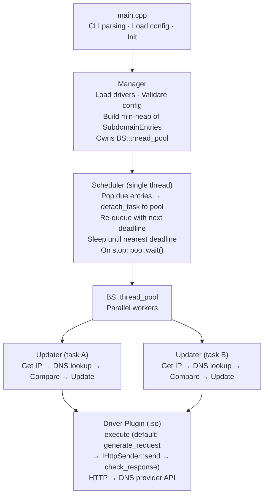

# yaddnsc — Yet Another Dynamic DNS Client

**yaddnsc** is a modern C++23 Dynamic DNS (DDNS) client that monitors your local IP addresses and automatically updates DNS records on supported DNS providers when changes are detected. It is designed to be lightweight, modular, and extensible through a plugin-based driver system.

## Features

- **Multi-domain, multi-subdomain management** — manage multiple domains and subdomains from a single configuration file.
- **Pluggable driver architecture** — drivers are loaded as shared libraries (`.so`) at runtime via `dlopen`. Built-in drivers:
  - [Cloudflare](https://www.cloudflare.com/) — updates DNS records via the Cloudflare API v4
  - [DigitalOcean](https://www.digitalocean.com/) — updates DNS records via the DigitalOcean API v2
  - [DNSPod](https://www.dnspod.com/) — updates DNS records via DNSPod API (supports both China and Global endpoints)
  - [Simple](https://github.com/Kotarou/yaddnsc) — a generic HTTP GET driver for custom API endpoints
- **Flexible IP source configuration** — per-subdomain, choose:
  - `interface` — obtain the IP from a local network interface
  - `url` — obtain the IP from an external HTTP service (e.g. `https://ifconfig.me`)
- **Per-subdomain update interval** — each subdomain can override the domain-level update interval.
- **IPv4 and IPv6 support** — configure A and AAAA records independently.
- **Custom DNS resolver** — optionally use specific DNS servers for record lookups instead of the system resolver. Supports multiple servers with **concurrent query** and automatic fallback (fires all configured resolvers in parallel and takes the fastest response).
- **Forced update scheduling** — periodically force-update DNS records even when the IP hasn't changed.
- **Graceful shutdown** — handles SIGINT/SIGTERM via a dedicated signal-handling thread with a stop_token.
- **Thread-pool based concurrency** — subdomain updates are dispatched to a BS::thread_pool for parallel execution.
- **C++23** — built with modern C++ standards, using `std::format` (or the fmt library as fallback) and `std::jthread`.
- **Cross-platform** — CI-tested on Linux (Ubuntu) and macOS.

## Architecture Overview



**Thread model:** A single scheduler thread maintains a min-heap of `SubdomainEntry` items ordered by deadline. When a subdomain is due, the scheduler pops it, submits the work (IP detection, DNS comparison, HTTP update) to the shared thread pool, and re-queues the entry with its next deadline. The scheduler sleeps on a condition variable until the nearest deadline or a stop request. On shutdown it drains all in-flight pool tasks before returning.

**HTTP abstraction layer:** All provider API communication flows through the `IHttpSender` interface. The concrete implementation — `HttpClient` — wraps [cpp-httplib](https://github.com/yhirose/cpp-httplib) internally and keeps `httplib` types out of all public headers. The core binds the correct network interface and address family from the per-subdomain config, then injects the sender into each driver call.

## Build Requirements

### Prerequisites

| Tool / Library  | Minimum Version    |
|-----------------|--------------------|
| CMake           | 3.28               |
| C++ Compiler    | C++23 capable      |
| OpenSSL         | Any recent version |
| Zlib            | Any recent version |

yaddnsc is POSIX-only. Supported compilers: GCC 14+, Clang 18+, Apple Clang 15+

### Building

```bash
# Install system dependencies (Debian/Ubuntu)
sudo apt install libssl-dev zlib1g-dev build-essential cmake

# Install system dependencies (macOS)
brew install openssl@3 cmake

# Build
mkdir build && cd build
cmake .. -DCMAKE_BUILD_TYPE=Release
make -j$(nproc)

# The main binary will be at build/objs/yaddnsc
# Driver modules will be at build/objs/driver/*.so
```

### CMake Options

| Option             | Default | Description                                      |
|--------------------|---------|--------------------------------------------------|
| `CMAKE_BUILD_TYPE` | Release | Set to `Debug` for debug builds                  |
| `YADDNSC_LOGGING_PATTERN` | `[%D %T.%e] [%^%8l%$] [%8!t] [%15!s:%-4#] %v` | Logging pattern passed to spdlog::set_pattern() |
| `YADDNSC_MIN_UPDATE_INTERVAL` | 60 | Minimum allowed update interval in seconds (must not be negative) |

Third-party dependencies (glaze, spdlog, cpp-httplib, cxxopts, BS::thread_pool, fmt) are fetched automatically via CPM.cmake.

## Configuration

yaddnsc uses a JSON configuration file. By default it looks for `./config.json`, or you can specify a custom path with the `-c` flag.

A template configuration is available at `config.example.json`.

### Example Configuration

```json
{
  "driver": {
    "driver_dir": "/opt/yaddnsc/drivers",
    "auto_discover": false,
    "load": [
      "cloudflare.so",
      "simple.so"
    ]
  },
  "resolver": {
    "use_custom_server": false,
    "ipaddress": "1.1.1.1",
    "port": 53,
    "servers": [
      { "ipaddress": "1.1.1.1", "port": 53 },
      { "ipaddress": "8.8.8.8", "port": 53 }
    ]
  },
  "domains": [
    {
      "name": "example.com",
      "update_interval": 300,
      "force_update": 0,
      "driver": "cloudflare",
      "subdomains": [
        {
          "name": "home",
          "type": "aaaa",
          "interface": "eth0",
          "ip_source": "interface",
          "ip_type": "ipv6",
          "ip_source_param": "",
          "allow_ula": false,
          "allow_local_link": false,
          "update_interval": 600,
          "driver_param": {
            "zone_id": "your-zone-id",
            "record_id": "your-record-id",
            "token": "your-api-token"
          }
        },
        {
          "name": "home",
          "type": "a",
          "interface": "",
          "ip_source": "url",
          "ip_type": "ipv4",
          "ip_source_param": "https://ipv4.example.com/",
          "allow_ula": false,
          "allow_local_link": false,
          "driver_param": {
            "zone_id": "your-zone-id",
            "record_id": "your-record-id",
            "token": "your-api-token"
          }
        }
      ]
    }
  ]
}
```

### Configuration Reference

#### Top-level

| Field      | Type     | Description                                   |
|------------|----------|-----------------------------------------------|
| `driver`   | object   | Driver loading configuration                  |
| `resolver` | object   | Custom DNS resolver settings (optional)       |
| `domains`  | array    | List of domain configurations                 |

#### `driver` object

| Field          | Type      | Description                                                       |
|----------------|-----------|-------------------------------------------------------------------|
| `driver_dir`   | string    | Directory containing driver `.so` files                           |
| `auto_discover`| boolean   | If true, automatically loads all `.so` files in `driver_dir` (ignores `load` list) |
| `load`          | string[]  | List of driver shared library filenames to load (ignored when `auto_discover` is true) |

#### `resolver` object

| Field               | Type           | Description                                                                                                    |
|---------------------|----------------|----------------------------------------------------------------------------------------------------------------|
| `use_custom_server` | boolean        | If true, use the specified DNS server(s) instead of system                                                     |
| `ipaddress`         | string         | DNS server IP address (legacy — used only when `servers` is empty)                                             |
| `port`              | integer        | DNS server port, typically 53 (legacy — used only when `servers` is empty)                                     |
| `servers`           | DnsServer[]    | List of DNS servers for redundancy. When multiple servers are configured, all queries are fired **concurrently** and the fastest successful response is used. If all servers fail, errors are propagated. |

When the `servers` array is present and non-empty, `ipaddress` and `port` are ignored. On platforms without `res_nquery()` support (e.g. some musl builds), custom servers cannot be configured and the system resolver is always used.

> **IPv6 note:** Write the address **without** brackets, e.g. `"2606:4700:4700::1111"`. Brackets are used for URI literals (`[::1]:53`) but `inet_pton()` — which validates and parses the address — expects a plain address.

#### `domains[]` object

| Field             | Type   | Description                                                                                 |
|-------------------|--------|---------------------------------------------------------------------------------------------|
| `name`            | string | Domain name (e.g. `example.com`)                                                            |
| `update_interval` | int    | Interval in seconds between updates (minimum: 60). Used as default for all subdomains.      |
| `force_update`    | int    | Interval in seconds for forced updates (0 = disabled). Must be >= `update_interval` if set. |
| `driver`          | string | Name of the driver to use (must match a loaded driver)                                      |
| `subdomains`      | array  | List of subdomain records to manage                                                         |

#### `subdomains[]` object

| Field              | Type    | Description                                                                                                |
|--------------------|---------|------------------------------------------------------------------------------------------------------------|
| `name`             | string  | Subdomain name (e.g. `home` for `home.example.com`)                                                        |
| `type`             | string  | DNS record type: `"a"`, `"aaaa"`, `"txt"`, or `"soa"`                                                      |
| `interface`        | string  | Network interface name (e.g. `eth0`). Required when `ip_source` is `"interface"`.                          |
| `ip_source`        | string  | IP source: `"interface"` (read from a local NIC) or `"url"` (fetch from HTTP)                              |
| `ip_type`          | string  | IP version: `"ipv4"`, `"ipv6"`, or `"unspecified"`                                                         |
| `ip_source_param`  | string  | For `"url"` source: the HTTP(S) URL. For `"interface"` source: currently unused.                           |
| `allow_ula`        | boolean | When using IPv6 interface source, allow Unique Local Addresses (default: false)                            |
| `allow_local_link` | boolean | When using IPv6 interface source, allow link-local addresses (default: false)                              |
| `update_interval`  | int     | Per-subdomain update interval in seconds (optional). 0 or omitted = inherit from `domain.update_interval`. |
| `driver_param`     | object  | Driver-specific parameters (key-value map)                                                                 |

## Driver Parameters

Each driver requires specific parameters in `driver_param`.

### Cloudflare (`cloudflare.so`)

| Parameter   | Required | Description                                      |
|-------------|----------|--------------------------------------------------|
| `zone_id`   | Yes      | Cloudflare Zone ID                               |
| `record_id` | Yes      | Cloudflare DNS Record ID                         |
| `token`     | Yes      | Cloudflare API Token (needs DNS:Edit permission) |
| `proxied`   | No       | Whether the record is proxied through Cloudflare |
| `ttl`       | No       | TTL in seconds (default: 30)                     |

API endpoint: `PUT https://api.cloudflare.com/client/v4/zones/{ZONE_ID}/dns_records/{RECORD_ID}`

### DigitalOcean (`digital_ocean.so`)

| Parameter   | Required | Description                          |
|-------------|----------|--------------------------------------|
| `record_id` | Yes      | DigitalOcean DNS Record ID           |
| `token`     | Yes      | DigitalOcean Personal Access Token   |

API endpoint: `PUT https://api.digitalocean.com/v2/domains/{DOMAIN}/records/{RECORD_ID}`

### DNSPod (`dnspod.so`)

| Parameter        | Required | Description                                                        |
|------------------|----------|--------------------------------------------------------------------|
| `domain_id`      | Yes      | DNSPod Domain ID                                                   |
| `record_id`      | Yes      | DNSPod Record ID                                                   |
| `login_token`    | Yes      | DNSPod API login token (ID,Token format)                           |
| `global`         | No       | Use global API endpoint (`true`) or China endpoint (`false`, default) |
| `record_line`    | No       | Record line (e.g. `"默认"` for default)                              |
| `record_line_id` | No       | Record line ID                                                     |

API endpoints:
- China: `POST https://dnsapi.cn/Record.Ddns`
- Global: `POST https://api.dnspod.com/Record.Ddns`

### Simple (`simple.so`)

A generic HTTP GET driver for custom APIs. The driver treats the `url` as a template and substitutes `{key}` placeholders with values from the configuration and runtime context.

| Parameter | Required | Description                           |
|-----------|----------|---------------------------------------|
| `url`     | Yes      | HTTP(S) URL template with `{key}` placeholders. All other `driver_param` keys are available for substitution as `{key}`. |

**Available substitution variables:**

| Variable       | Source         | Description                |
|----------------|----------------|----------------------------|
| `{ip_addr}`    | Runtime        | The detected IP address    |
| `{rd_type}`    | Runtime        | DNS record type (A, AAAA)  |
| `{domain}`     | Runtime        | Domain name                |
| `{subdomain}`  | Runtime        | Subdomain name             |
| `{fqdn}`       | Runtime        | Full domain name           |
| `{any_key}`    | `driver_param` | Any key from `driver_param` (except `url`) |

Example:
```json
"driver_param": {
    "url": "https://api.example.com/update?ip={ip_addr}&type={rd_type}&domain={domain}",
    "key": "my-secret-key"
}
```

A successful response is any non-empty body.

## Usage

```bash
# Basic usage with default config path
yaddnsc

# Specify a config file
yaddnsc -c /etc/yaddnsc/config.json

# Enable verbose (debug) logging
yaddnsc -v

# Print version
yaddnsc -V

# Print help
yaddnsc -h
```

### Systemd Service

A sample systemd service file is provided at `yaddnsc.service`:

```bash
sudo cp yaddnsc /opt/yaddnsc/
sudo mkdir -p /etc/yaddnsc/
sudo cp config.json /etc/yaddnsc/
sudo cp yaddnsc.service /etc/systemd/system/
sudo systemctl enable --now yaddnsc
```

## Writing a Custom Driver

Drivers are shared libraries loaded at runtime. To write one:

1. Include `driver/base_driver.h` and inherit from `BaseDriver`.
2. Implement the `IDriver` interface:
   - `generate_request(config, ctx)` → construct a `driver_request` (URL, HTTP method, headers, body)
   - `check_response(response)` → validate the API response body
   - `get_detail()` → return driver metadata (name, description, author, version)
   - `execute(config, ctx, http)` → drive the full update workflow (see below)
3. Use the `DEFINE_DRIVER_FACTORY(YourDriverClass)` macro at the bottom of the implementation file to export the `create()` and `destroy()` factory functions.
4. Build as a `MODULE` library (position-independent code, no `lib` prefix).
5. Place the resulting `.so` in the driver directory and add it to the `load` list in the config.

Drivers use `CORE_LOG_*` macros for logging — these delegate to the core executable's logging subsystem via symbol resolution at `dlopen` time.

### The `execute()` method

`execute()` is the entry point for a driver to perform its update. It receives:

- `config` — the parsed driver configuration (typically a JSON string).
- `ctx` — an `UpdateContext` with runtime information (IP address, record type, domain, subdomain, FQDN).
- `http` — an `IHttpSender` reference for making HTTP requests.

The default implementation in `BaseDriver` reproduces the original three-step behaviour:

```
generate_request(config, ctx)
    → http.send(request)
    → check_response(response.body)
```

For simple drivers this is sufficient — just implement `generate_request()` and `check_response()`, and the default `execute()` is inherited automatically.

The `IHttpSender` is initialised by the core with the correct address family (IPv4/IPv6) and network interface from the per-subdomain configuration. Drivers that override `execute()` can call `set_address_family()` to switch between calls when needed.

### Multi-step workflows with `IHttpSender`

Drivers that need multiple HTTP interactions (e.g. authenticate first, then query a resource, then update) can override `execute()` and call `http.send()` multiple times:

```
bool MyDriver::execute(const driver_config_type &config,
                       const UpdateContext &ctx,
                       IHttpSender &http) override {
    // Step 1: fetch authentication token
    http.set_address_family(address_family::IPV4);
    auto auth_resp = http.send(build_auth_request(config));
    if (!auth_resp.success) return false;
    auto token = extract_token(auth_resp.body);

    // Step 2: query record id
    auto list_resp = http.send(build_list_request(token, ctx));
    if (!list_resp.success) return false;
    auto record_id = extract_record_id(list_resp.body);

    // Step 3: perform the update
    auto update_req = build_update_request(token, record_id, ctx);
    auto update_resp = http.send(update_req);
    if (!update_resp.success) return false;
    return check_response(update_resp.body);
}
```

The `IHttpSender` interface provides:

```cpp
class IHttpSender {
public:
    virtual void set_address_family(address_family af) = 0;
    virtual HttpResponse send(const http_request &req) = 0;
};
```

`HttpResponse` contains the full HTTP result:

| Field             | Type                           | Description                          |
|-------------------|--------------------------------|--------------------------------------|
| `success`         | `bool`                         | Whether the request was sent         |
| `status_code`     | `int`                          | HTTP status code (e.g. 200, 404)     |
| `headers`         | `multimap<string, string>`     | Response headers                     |
| `body`            | `string`                       | Response body                        |
| `error_message`   | `string`                       | Transport-level error description    |

The network interface is always bound by the core and is not configurable from the driver. Address family can be switched between calls via `set_address_family()`.

## Dependencies

| Library                                                     | Purpose                                        | Management   |
|-------------------------------------------------------------|------------------------------------------------|--------------|
| [glaze](https://github.com/stephenberry/glaze)              | JSON serialization/reflection                  | CPM.cmake    |
| [spdlog](https://github.com/gabime/spdlog)                  | Logging                                        | CPM.cmake    |
| [cpp-httplib](https://github.com/yhirose/cpp-httplib)       | HTTP client                                    | CPM.cmake    |
| [cxxopts](https://github.com/jarro2783/cxxopts)             | CLI option parsing                             | CPM.cmake    |
| [BS::thread_pool](https://github.com/bshoshany/thread-pool) | Thread pool                                    | CPM.cmake    |
| [fmt](https://github.com/fmtlib/fmt)                        | String formatting (fallback if no std::format) | CPM.cmake    |
| [magic_enum](https://github.com/Neargye/magic_enum)         | Static enum reflection                         | CPM.cmake    |
| OpenSSL                                                     | TLS support                                    | System       |
| Zlib                                                        | Compression                                    | System       |

## License

This project is licensed under the terms specified in the [LICENSE](LICENSE) file.
