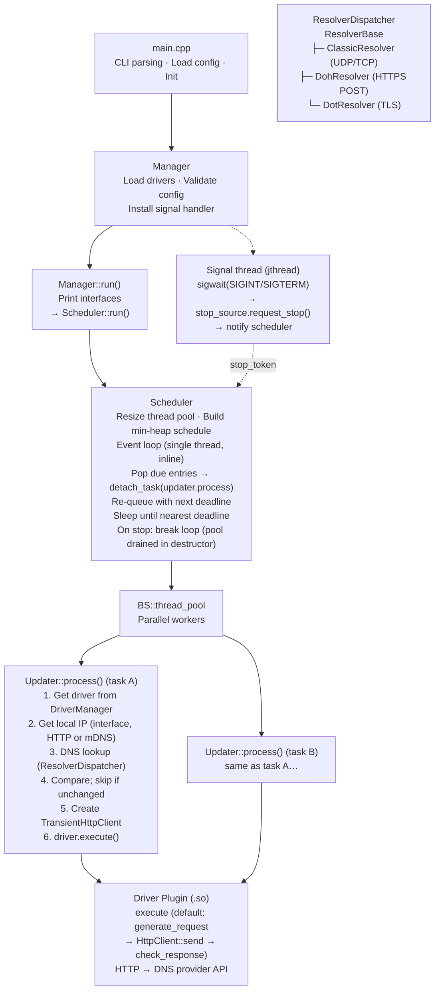

# yaddnsc — Yet Another Dynamic DNS Client

**yaddnsc** is a modern C++23 Dynamic DNS (DDNS) client that monitors your local IP addresses and automatically updates DNS records on supported DNS providers when changes are detected. It is designed to be lightweight, modular, and extensible through a plugin-based driver system.

## Features

- **Multi-domain, multi-subdomain management** — manage multiple domains and subdomains from a single configuration file.
- **Pluggable driver architecture** — drivers are loaded as shared libraries (`.so`) at runtime via `dlopen`. Built-in drivers:
  - [Cloudflare](https://www.cloudflare.com/) — updates DNS records via the Cloudflare API v4
  - [DigitalOcean](https://www.digitalocean.com/) — updates DNS records via the DigitalOcean API v2
  - [DNSPod](https://www.dnspod.com/) — updates DNS records via DNSPod API (supports both China and Global endpoints)
  - [Simple](https://github.com/Kotarou/yaddnsc) — a generic HTTP driver with URL template substitution for custom API endpoints
- **Flexible IP source configuration** — per-subdomain, choose:
  - `interface` — obtain the IP from a local network interface
  - `http` — obtain the IP from an external HTTP service (e.g. `https://ifconfig.me`)
  - `mdns` — discover a LAN device's IP address via mDNS (RFC 6762, e.g. `printer.local`)
- **Per-subdomain update interval** — each subdomain can override the domain-level update interval.
- **IPv4 and IPv6 support** — configure A and AAAA records independently.
- **Custom DNS resolver** — optionally use specific DNS servers for record lookups instead of the system resolver. Supports traditional DNS, DNS-over-HTTPS (DoH), and DNS-over-TLS (DoT) with configurable query strategies. See [DNS Resolver](#dns-resolver) for details.
- **Forced update scheduling** — periodically force-update DNS records even when the IP hasn't changed.
- **Graceful shutdown** — handles SIGINT/SIGTERM via a dedicated signal-handling thread with a stop_token.
- **Thread-pool based concurrency** — subdomain updates are dispatched to a BS::thread_pool for parallel execution.
- **C++23** — built with modern C++ standards, using `std::format` (or the fmt library as fallback) and `std::jthread`.
- **Cross-platform** — CI-tested on Linux (Ubuntu) and macOS.

## Architecture Overview



**Thread model:** A single scheduler thread (inline in `Scheduler::run()`, called from `Manager::run()`) maintains a min-heap of `SubdomainEntry` items ordered by deadline. When a subdomain is due, the scheduler pops it, submits `Updater::process(task)` to the shared thread pool, and re-queues the entry with its next deadline. The scheduler sleeps on a condition variable until the nearest deadline or a stop request. On shutdown the heap is discarded and the pool is drained in the `Scheduler` destructor before the program exits.

**Signal handling:** A dedicated `std::jthread` waits on `sigwait()` for `SIGINT`/`SIGTERM`. When a signal arrives, it calls `stop_source.request_stop()`, which triggers a `std::stop_callback` that notifies the scheduler's condition variable, waking the loop so it can break out. Pending pool tasks are drained in the `Scheduler` destructor before the program exits.

**Updater::process()** (runs in a pool thread) does the following for each subdomain:

1. **Resolve the driver** — look up the driver plugin by name from `DriverManager`.
2. **Get local IP** — resolve via the IP source abstraction (`IpSourceBase`), which reads from a local network interface (`InterfaceIpSource`), fetches from an external URL (`HttpIpSource`), or discovers a LAN device via mDNS (`MdnsIpSource`). Delegates creation to `IpSourceFactory` based on per-subdomain configuration.
3. **DNS lookup** — query the current DNS record using `ClassicResolver` (UDP/TCP), `DohResolver` (HTTPS POST, RFC 8484), or `DotResolver` (TLS, RFC 7858).
4. **Compare** — skip the update if unchanged (unless `force_update` is set).
5. **Create `TransientHttpClient`** — a per-task HTTP client that creates a new httplib::Client on every `send()` call.
6. **Call `driver.execute()`** — delegates to the driver plugin, which calls `generate_request()` → `HttpClient::send()` → `check_response()`.

**HTTP abstraction layer:** All provider API communication flows through the `HttpClient` interface. Two concrete implementations exist: `TransientHttpClient` creates a fresh [cpp-httplib](https://github.com/yhirose/cpp-httplib) client per request (used by the updater for driver execution), while `PersistentHttpClient` reuses a single connection across multiple calls (used internally by the DoH resolver). Address family and network interface are configured per-use via `HttpClientOptions`.

## Build Requirements

### Prerequisites

| Tool / Library  | Minimum Version    |
|-----------------|--------------------|
| CMake           | 3.28               |
| C++ Compiler    | C++23 capable      |
| OpenSSL         | 3.0+               |
| Zlib            | Any recent version |

yaddnsc is POSIX-only. Supported compilers: GCC 14+, Clang 18+, Apple Clang 15+.

### Building

```bash
# Install system dependencies (Debian/Ubuntu)
sudo apt install libssl-dev zlib1g-dev build-essential cmake

# Install system dependencies (macOS)
brew install openssl@3 cmake

# Build
mkdir build && cd build
cmake .. -DCMAKE_BUILD_TYPE=Release
make -j$(nproc)

# The main binary will be at build/objs/yaddnsc
# Driver modules will be at build/objs/driver/*.so
```

### Platform Notes

**Legacy devices** — If your toolchain is older (GCC < 14 or Clang < 18), use the `v0.x` (legacy) branch (C++17, CMake 3.14+, OpenSSL 1.1.x). It is in maintenance mode and will not receive new features but will get critical bug fixes. DoT/DoH resolvers are also available there.

**Alpine Linux** — musl ships a downgraded, classic-style `resolv` stub. It lacks modern features and may suffer from performance issues and limitations compared to glibc's resolver. On Alpine, it is strongly recommended to configure the resolver to use **DoT** (DNS over TLS) or **DoH** (DNS over HTTPS) instead of the system resolver.

### CMake Options

| Option                        | Default                                       | Description                                                       |
|-------------------------------|-----------------------------------------------|-------------------------------------------------------------------|
| `CMAKE_BUILD_TYPE`            | Release                                       | Set to `Debug` for debug builds                                   |
| `YADDNSC_LOGGING_PATTERN`     | `[%D %T.%e] [%^%8l%$] [%8!t] [%15!s:%-4#] %v` | Logging pattern passed to spdlog::set_pattern()                   |
| `YADDNSC_MIN_UPDATE_INTERVAL` | 60                                            | Minimum allowed update interval in seconds (must not be negative) |
| `YADDNSC_MANUAL_MKQUERY`      | OFF                                          | Use a self-contained manual DNS query builder instead of system `res_mkquery()`. Useful when the system stub is incomplete or undesirable (e.g. to avoid EDNS0 records from resolver config). |
| `YADDNSC_USE_SYSTEM_SPDLOG`   | OFF                                          | Use spdlog from the system package instead of the bundled CPM-downloaded version. When enabled, also uses the system fmt library. |

Third-party dependencies (glaze, spdlog, cpp-httplib, CLI11, BS::thread_pool, fmt, magic_enum) are fetched automatically via CPM.cmake.

## Configuration

yaddnsc uses a JSON configuration file. By default it looks for `./config.json`, or you can specify a custom path with the `-c` flag.

A template configuration is available at `config.example.json`.

### Example Configuration

```json
{
  "driver": {
    "driver_dir": "/opt/yaddnsc/drivers",
    "auto_discover": false,
    "load": [
      "cloudflare.so",
      "simple.so"
    ]
  },
  "resolver": {
    "use_custom_server": false,
    "strategy": "concurrent",
    "servers": [
      { "address": "1.1.1.1", "port": 53 },
      { "address": "8.8.8.8", "port": 53 }
    ]
  },
  "domains": [
    {
      "name": "example.com",
      "update_interval": 300,
      "force_update": 0,
      "driver": "cloudflare",
      "subdomains": [
        {
          "name": "home",
          "type": "aaaa",
          "interface": "eth0",
          "ip_source": "interface",
          "allow_ula": false,
          "allow_local_link": false,
          "update_interval": 600,
          "driver_param": {
            "zone_id": "your-zone-id",
            "record_id": "your-record-id",
            "token": "your-api-token"
          }
        },
        {
          "name": "home",
          "type": "a",
          "ip_source": "http",
          "ip_source_param": "https://ipv4.example.com/",
          "allow_ula": false,
          "allow_local_link": false,
          "driver_param": {
            "zone_id": "your-zone-id",
            "record_id": "your-record-id",
            "token": "your-api-token"
          }
        }
      ]
    }
  ]
}
```

### Configuration Reference

#### Top-level

| Field      | Type     | Description                                   |
|------------|----------|-----------------------------------------------|
| `driver`   | object   | Driver loading configuration                  |
| `resolver` | object   | Custom DNS resolver settings (optional)       |
| `domains`  | array    | List of domain configurations                 |

#### `driver` object

| Field           | Type     | Description                                                                            |
|-----------------|----------|----------------------------------------------------------------------------------------|
| `driver_dir`    | string   | Directory containing driver `.so` files                                                |
| `auto_discover` | boolean  | If true, automatically loads all `.so` files in `driver_dir` (ignores `load` list)     |
| `load`          | string[] | List of driver shared library filenames to load (ignored when `auto_discover` is true) |

#### `resolver` object

| Field               | Type        | Description                                                                                                                                                                                              |
|---------------------|-------------|----------------------------------------------------------------------------------------------------------------------------------------------------------------------------------------------------------|
| `use_custom_server` | boolean     | If true, use the specified DNS server(s) instead of system                                                                                                                                               |
| `address`           | string      | DNS server address (legacy — used only when `servers` is empty). See [DNS Resolver](#dns-resolver) for supported formats. |
| `port`              | integer     | DNS server port, typically 53 (legacy — used only when `servers` is empty). Ignored for DoH/DoT.                                         |
| `servers`           | DnsServer[] | List of DNS servers. See [DNS Resolver](#dns-resolver) for supported address formats and per-type port behaviour.                                          |
| `strategy`          | string      | Query strategy: `"concurrent"` (default) or `"fallback"`. See [DNS Resolver](#dns-resolver).                                        |

Each `DnsServer` entry in the `servers` array has the following structure:

| Field     | Type    | Description                                                                                                                                                                                               |
|-----------|---------|-----------------------------------------------------------------------------------------------------------------------------------------------------------------------------------------------------------|
| `address` / `ipaddress` | string  | DNS server address. Format depends on resolver type — see [DNS Resolver](#dns-resolver). Also accepted as `ipaddress` for compatibility. |
| `port`    | integer | DNS server port, typically 53. Ignored for DoH/DoT — see [DNS Resolver](#dns-resolver).                                       |

When the `servers` array is present and non-empty, the legacy `address` and `port` fields are ignored. On platforms without `res_nquery()` support (e.g. some musl builds), custom servers cannot be configured and the system resolver is always used.

#### `domains[]` object

| Field             | Type   | Description                                                                                 |
|-------------------|--------|---------------------------------------------------------------------------------------------|
| `name`            | string | Domain name (e.g. `example.com`)                                                            |
| `update_interval` | int    | Interval in seconds between updates (minimum: 60). Used as default for all subdomains.      |
| `force_update`    | int    | Interval in seconds for forced updates (0 = disabled). Must be >= `update_interval` if set. |
| `driver`          | string | Name of the driver to use (must match a loaded driver)                                      |
| `subdomains`      | array  | List of subdomain records to manage                                                         |

#### `subdomains[]` object

| Field              | Type    | Description                                                                                                          |
|--------------------|---------|----------------------------------------------------------------------------------------------------------------------|
| `name`             | string  | Subdomain name (e.g. `home` for `home.example.com`)                                                                  |
| `type`             | string  | DNS record type: `"a"`, `"aaaa"`, `"txt"`, or `"soa"`. Determines address family automatically (A → IPv4, AAAA → IPv6). |
| `interface`        | string  | Network interface name (e.g. `eth0`). See [IP Source](#ip-source) for per-source requirements. |
| `ip_type`          | string  | **Deprecated — ignored.** Address family is now derived from `type` (A → IPv4, AAAA → IPv6). |
| `ip_source`        | string  | IP source strategy: `"interface"`, `"http"` (or alias `"url"`), or `"mdns"`. See [IP Source](#ip-source) for details. |
| `ip_source_param`  | string  | Source-specific parameter (URL for `"http"`, mDNS hostname for `"mdns"`). See [IP Source](#ip-source) for details. Ignored for `"interface"`. |
| `allow_ula`        | boolean | When using IPv6 interface source, allow Unique Local Addresses (default: false)                                      |
| `allow_local_link` | boolean | When using IPv6 interface source, allow link-local addresses (default: false)                                        |
| `update_interval`  | int     | Per-subdomain update interval in seconds (optional). 0 or omitted = inherit from `domain.update_interval`.           |
| `driver_param`     | object  | Driver-specific parameters (key-value map)                                                                           |

> **Note:** The `interface` field is **required** only for the `"interface"` IP source. For `"http"` and `"mdns"` sources it is **optional** — when specified, the HTTP request or mDNS query is bound to that interface; when omitted, the system's default route is used.

## IP Source

The `ip_source` field in a `subdomains[]` entry determines how yaddnsc discovers the IP address to update. Three sources are supported:

### `interface` — Read from a local network interface

Reads the IP address directly from a specified local network interface (NIC). This is ideal for devices with a static local address or when you want to report the address bound to a specific interface.

```json
{
    "name": "home",
    "type": "a",
    "interface": "eth0",
    "ip_source": "interface"
}
```

| Field       | Required | Description                                          |
|-------------|----------|------------------------------------------------------|
| `interface` | Yes      | Network interface name to read the IP from (e.g. `eth0`, `wlan0`). |
| `ip_source_param` | No | Ignored for this source.                             |

### `http` — Fetch from an HTTP(S) endpoint

Fetches the IP address from an external HTTP(S) service that returns the client's IP in the response body (e.g. `https://api.ipify.org`). The HTTP request is bound to the specified network interface.

```json
{
    "name": "home",
    "type": "a",
    "interface": "eth0",
    "ip_source": "http",
    "ip_source_param": "https://api.ipify.org"
}
```

| Field              | Required | Description                                              |
|--------------------|----------|----------------------------------------------------------|
| `interface`        | No       | Network interface to bind the HTTP request to. If omitted, uses the default route. |
| `ip_source_param`  | Yes      | HTTP(S) URL that returns the IP address in the response body. |

### `mdns` — Discover via mDNS (RFC 6762)

Discovers the IP address of a LAN device by sending a multicast DNS query for a `.local` hostname (e.g. `printer.local`). This is useful for detecting the address of devices on the local network, such as printers, NAS, or IoT devices.

```json
{
    "name": "printer",
    "type": "a",
    "ip_source": "mdns",
    "ip_source_param": "printer.local"
}
```

```json
{
    "name": "nas",
    "type": "aaaa",
    "interface": "eth0",
    "ip_source": "mdns",
    "ip_source_param": "nas.local"
}
```

| Field              | Required | Description                                              |
|--------------------|----------|----------------------------------------------------------|
| `interface`        | No       | Network interface to send the mDNS query on. If omitted, uses the default route. |
| `ip_source_param`  | Yes      | The mDNS hostname to query. Must end with `.local` (or `.local.`) as per RFC 6762 §3. |

> **Platform notes:** The client sends raw mDNS queries directly via UDP multicast — no system mDNS daemon is required on the client machine for outgoing queries. The **target device** must be running an mDNS responder to reply (e.g. Avahi or systemd-resolved with mDNS enabled on Linux; mDNSResponder on macOS; most embedded devices have this built in). Tested on Linux, macOS, and FreeBSD.

## DNS Resolver

yaddnsc can use custom DNS servers for record lookups instead of the system resolver. Configure the `resolver` object at the top level of your configuration file.

### Resolver Types

Three resolver types are supported, auto-detected from the address format:

#### Traditional DNS (UDP/TCP)

Uses standard DNS over UDP (or TCP for large responses) on a given IP and port.

```json
{
  "resolver": {
    "use_custom_server": true,
    "servers": [
      { "address": "1.1.1.1", "port": 53 },
      { "address": "8.8.8.8", "port": 53 }
    ]
  }
}
```

| Field     | Description                                                              |
|-----------|--------------------------------------------------------------------------|
| `address` | Plain IP address (e.g. `"1.1.1.1"`). Use **without** brackets for IPv6. |
| `port`    | UDP/TCP port, typically 53.                                              |

> **IPv6 note:** Write IPv6 addresses without brackets, e.g. `"2606:4700:4700::1111"`. Brackets are used for URI literals (`[::1]:53`), but `inet_pton()` expects a plain address.

#### DNS-over-HTTPS (DoH)

Encrypts DNS queries via HTTPS POST (RFC 8484).

```json
{
  "resolver": {
    "use_custom_server": true,
    "servers": [
      { "address": "https://1.1.1.1/dns-query" },
      { "address": "https://cloudflare-dns.com/dns-query" }
    ]
  }
}
```

| Field     | Description                                                                                         |
|-----------|-----------------------------------------------------------------------------------------------------|
| `address` | Full HTTPS URL **including the path** (e.g. `"https://1.1.1.1/dns-query"`). Must start with `https://`. |
| `port`    | Ignored — HTTPS uses port 443 by default.                                                           |

> The address must be a complete URL with the full path. The code does **not** append `/dns-query` automatically.

#### DNS-over-TLS (DoT)

Encrypts DNS queries via TLS (RFC 7858).

```json
{
  "resolver": {
    "use_custom_server": true,
    "servers": [
      { "address": "tls://1.1.1.1" }
    ]
  }
}
```

| Field     | Description                                                              |
|-----------|--------------------------------------------------------------------------|
| `address` | `tls://` URI (e.g. `"tls://1.1.1.1"`).                                  |
| `port`    | Ignored — TLS uses port 853 by default.                                  |

### Query Strategy

The `strategy` field controls how multiple DNS servers are queried:

| Strategy     | Behaviour                                                                 |
|--------------|---------------------------------------------------------------------------|
| `concurrent` | **(Default)** Fire resolvers in batches of 3 in parallel and return the fastest successful response. |
| `fallback`   | Try the first resolver; if it fails, try the next one in order.           |

```json
{
  "resolver": {
    "use_custom_server": true,
    "strategy": "fallback",
    "servers": [
      { "address": "https://1.1.1.1/dns-query" },
      { "address": "tls://1.1.1.1" }
    ]
  }
}
```

### Platform Notes

Custom DNS servers rely on `res_nquery()`. On platforms without this function (e.g. some musl-based builds), the system resolver is always used and custom server configuration is ignored.

## Driver Parameters

Each driver requires specific parameters in `driver_param`.

### Cloudflare (`cloudflare.so`)

| Parameter   | Required | Description                                      |
|-------------|----------|--------------------------------------------------|
| `zone_id`   | Yes      | Cloudflare Zone ID                               |
| `record_id` | Yes      | Cloudflare DNS Record ID                         |
| `token`     | Yes      | Cloudflare API Token (needs DNS:Edit permission) |
| `proxied`   | No       | Whether the record is proxied through Cloudflare |
| `ttl`       | No       | TTL in seconds (default: 30)                     |

API endpoint: `PUT https://api.cloudflare.com/client/v4/zones/{ZONE_ID}/dns_records/{RECORD_ID}`

### DigitalOcean (`digital_ocean.so`)

| Parameter   | Required | Description                          |
|-------------|----------|--------------------------------------|
| `record_id` | Yes      | DigitalOcean DNS Record ID           |
| `token`     | Yes      | DigitalOcean Personal Access Token   |

API endpoint: `PUT https://api.digitalocean.com/v2/domains/{DOMAIN}/records/{RECORD_ID}`

### DNSPod (`dnspod.so`)

| Parameter        | Required | Description                                                           |
|------------------|----------|-----------------------------------------------------------------------|
| `domain_id`      | Yes      | DNSPod Domain ID                                                      |
| `record_id`      | Yes      | DNSPod Record ID                                                      |
| `login_token`    | Yes      | DNSPod API login token (ID,Token format)                              |
| `global`         | No       | Use global API endpoint (`true`) or China endpoint (`false`, default) |
| `record_line`    | No       | Record line (e.g. `"默认"` for default, `"default"` for global)         |
| `record_line_id` | No       | Record line ID (default: `"0"`)                                       |

API endpoints:
- China: `POST https://dnsapi.cn/Record.Ddns`
- Global: `POST https://api.dnspod.com/Record.Ddns`

### Simple (`simple.so`)

A generic HTTP GET driver for custom APIs. The driver treats the `url` as a template and substitutes `{key}` placeholders with values from the configuration and runtime context.

| Parameter | Required | Description                                                                                                              |
|-----------|----------|--------------------------------------------------------------------------------------------------------------------------|
| `url`     | Yes      | HTTP(S) URL template with `{key}` placeholders. All other `driver_param` keys are available for substitution as `{key}`. |

**Available substitution variables:**

| Variable      | Source         | Description                                |
|---------------|----------------|--------------------------------------------|
| `{ip_addr}`   | Runtime        | The detected IP address                    |
| `{rd_type}`   | Runtime        | DNS record type (A, AAAA)                  |
| `{domain}`    | Runtime        | Domain name                                |
| `{subdomain}` | Runtime        | Subdomain name                             |
| `{fqdn}`      | Runtime        | Full domain name                           |
| `{any_key}`   | `driver_param` | Any key from `driver_param` (except `url`) |

Example:
```json
{
  "driver_param": {
    "url": "https://api.example.com/update?ip={ip_addr}&type={rd_type}&domain={domain}",
    "key": "my-secret-key"
  }
}
```

A successful response is any non-empty body.

## Usage

```bash
# Run the DDNS client (default config path: ./config.json)
yaddnsc run

# Run with a specific config file and verbose logging
yaddnsc -c /etc/yaddnsc/config.json -v run

# Validate configuration and exit
yaddnsc config test

# Print resolved configuration as JSON
yaddnsc config show

# List loaded drivers
yaddnsc driver list

# Show driver details
yaddnsc driver info <name>

# List network interfaces
yaddnsc interface list

# Show IP addresses of a specific interface
yaddnsc interface ip <name>

# DNS resolve a hostname
yaddnsc dns resolve <hostname> [--type A|AAAA|TXT|SOA]

# Show configured DNS resolver details
yaddnsc dns resolver

# Print version
yaddnsc --version

# Print help
yaddnsc --help
yaddnsc <subcommand> --help
```

### Systemd Service

A sample systemd service file is provided at `yaddnsc.service`, with integrated
configuration validation (`config test`) before every start, security hardening
(DynamicUser, ProtectSystem, ProtectHome), and optional overrides via
`/etc/default/yaddnsc`:

```bash
sudo cp yaddnsc /opt/yaddnsc/
sudo mkdir -p /etc/yaddnsc/
sudo cp config.json /etc/yaddnsc/
sudo cp yaddnsc.service /etc/systemd/system/
sudo systemctl daemon-reload
sudo systemctl enable --now yaddnsc
```

## Writing a Custom Driver

Drivers are shared libraries loaded at runtime. To write one:

1. Include `driver/base_driver.h` and inherit from `BaseDriver`.
2. Implement the `Driver` interface:
   - `generate_request(config, ctx)` → construct a `DriverRequest` (URL, HTTP method, headers, body)
   - `check_response(response)` → validate the API response body
   - `get_detail()` → return driver metadata (name, description, author, version)
   - `get_driver_version()` → return the ABI version constant (implemented as `final` in `BaseDriver` — no need to override)
   - `execute(config, ctx, http)` → drive the full update workflow (default provided by `BaseDriver`, override for multi-step workflows)
3. Use the `DEFINE_DRIVER_FACTORY(YourDriverClass)` macro at the bottom of the implementation file to export the `create()` and `destroy()` factory functions.
4. Build as a `MODULE` library (position-independent code, no `lib` prefix).
5. Place the resulting `.so` in the driver directory and add it to the `load` list in the config.

Drivers use `CORE_LOG_*` macros for logging — these delegate to the core executable's logging subsystem via symbol resolution at `dlopen` time.

`BaseDriver` also provides a `parse_config<T>()` helper that parses the driver configuration JSON into a typed struct with built-in validation (using glaze). On missing required keys it throws `ParamParseException`, so your driver does not need to manually validate each field.

### The `execute()` method

`execute()` is the entry point for a driver to perform its update. It receives:

- `config` — the driver configuration (a JSON string, typically parsed with `parse_config<T>()`).
- `ctx` — an `UpdateContext` with runtime information (IP address, record type, domain, subdomain, FQDN).
- `http` — a `HttpClient` reference for making HTTP requests.

The default implementation in `BaseDriver` reproduces the original three-step behaviour:

```
generate_request(config, ctx)
    → http.send(request)
    → check_response(response.body)
```

For simple drivers this is sufficient — just implement `generate_request()` and `check_response()`, and the default `execute()` is inherited automatically.

The `HttpClient` is constructed per-update by the updater as a default-constructed `TransientHttpClient`. Drivers that override `execute()` receive this client and can use it directly. If address family or network interface binding is needed, construct the `TransientHttpClient` (or `PersistentHttpClient`) with a custom `HttpClientOptions` inside the override.

### Multi-step workflows with `HttpClient`

Drivers that need multiple HTTP interactions (e.g. authenticate first, then query a resource, then update) can override `execute()` and call `http.send()` multiple times:

```
bool MyDriver::execute(const DriverConfig &config,
                       const UpdateContext &ctx,
                       HttpClient &http) override {
    // Step 1: fetch authentication token
    auto auth_resp = http.send(build_auth_request(config));
    if (!auth_resp) return false;
    auto token = extract_token(auth_resp->body);

    // Step 2: query record id
    auto list_resp = http.send(build_list_request(token, ctx));
    if (!list_resp) return false;
    auto record_id = extract_record_id(list_resp->body);

    // Step 3: perform the update
    auto update_req = build_update_request(token, record_id, ctx);
    auto update_resp = http.send(update_req);
    if (!update_resp) return false;
    return check_response(update_resp->body);
}
```

The `HttpClient` interface provides:

```cpp
class HttpClient {
public:
    virtual HttpResponse send(const HttpRequest &req) const = 0;
    static std::string params_to_query_string(const HttpParams &params);
};
```

`HttpResult` is a type alias for `std::expected<HttpResponse, std::string>`. Check it with implicit boolean conversion (success) or use `error()` to retrieve the error string:

| Expression          | Description                                 |
|---------------------|---------------------------------------------|
| `if (resp)`         | Returns `true` if the request was sent      |
| `resp->status_code` | HTTP status code (e.g. 200, 404)            |
| `resp->headers`     | `multimap<string, string>` response headers |
| `resp->body`        | `string` response body                      |
| `resp.error()`      | `string` transport-level error description  |

## Dependencies

| Library                                                     | Purpose                                        | Management   |
|-------------------------------------------------------------|------------------------------------------------|--------------|
| [glaze](https://github.com/stephenberry/glaze)              | JSON serialization/reflection                  | CPM.cmake    |
| [spdlog](https://github.com/gabime/spdlog)                  | Logging                                        | CPM.cmake    |
| [cpp-httplib](https://github.com/yhirose/cpp-httplib)       | HTTP client                                    | CPM.cmake    |
| [CLI11](https://github.com/CLIUtils/CLI11)                   | CLI option parsing                             | CPM.cmake    |
| [BS::thread_pool](https://github.com/bshoshany/thread-pool) | Thread pool                                    | CPM.cmake    |
| [fmt](https://github.com/fmtlib/fmt)                        | String formatting (fallback if no std::format) | CPM.cmake    |
| [magic_enum](https://github.com/Neargye/magic_enum)         | Static enum reflection                         | CPM.cmake    |
| OpenSSL                                                     | TLS support                                    | System       |
| Zlib                                                        | Compression                                    | System       |

## License

This project is licensed under the terms specified in the [LICENSE](LICENSE) file.
