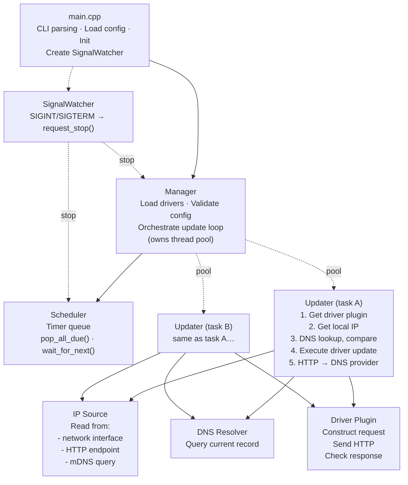

# yaddnsc — Yet Another Dynamic DNS Client

[](https://opensource.org/licenses/MIT)
[](https://github.com/CyberKoo/yaddnsc/actions/workflows/ci.yml)
[](https://en.cppreference.com/w/cpp/23)
[](https://codecov.io/github/CyberKoo/yaddnsc)
[]()
[]()
[]()

> **⚠️ Warning:** The `master` branch (v1.x) is under heavy development. The v1 ABI has not yet been finalized and may change significantly — plugins **must** be recompiled after each update.

**yaddnsc** is a modern Dynamic DNS (DDNS) client that monitors your local IP addresses and automatically updates DNS records on supported DNS providers when changes are detected. It is designed to be lightweight, modular, and extensible through a plugin-based driver system.

## Features

- **Multi-domain, multi-subdomain management** — manage multiple domains and subdomains from a single configuration file.
- **Pluggable driver architecture** — drivers are loaded as shared libraries (`.so`) at runtime. Built-in drivers include:
  - [Cloudflare](https://www.cloudflare.com/) — updates DNS records via the Cloudflare API v4
  - [DigitalOcean](https://www.digitalocean.com/) — updates DNS records via the DigitalOcean API v2
  - [DNSPod](https://www.dnspod.com/) — updates DNS records via DNSPod API (supports both China and Global endpoints)
  - [Simple](https://github.com/Kotarou/yaddnsc) — a generic HTTP driver with URL template substitution for custom API endpoints
- **Flexible IP source configuration** — each subdomain can choose from:
  - `interface` — obtain the IP from a local network interface
  - `http` — obtain the IP from an external HTTP service (e.g. `https://ifconfig.me`)
  - `mdns` — discover a LAN device's IP address via mDNS (RFC 6762, e.g. `printer.local`)
- **Per-subdomain update interval** — each subdomain can override the domain-level update interval.
- **IPv4 and IPv6 support** — configure A and AAAA records independently.
- **Custom DNS resolver** — optionally use specific DNS servers instead of the system resolver. Supports **traditional DNS**, **DNS-over-HTTPS (DoH)**, and **DNS-over-TLS (DoT)** with configurable query strategies.
- **Forced update scheduling** — periodically force-update DNS records even when the IP hasn't changed.
- **Graceful shutdown** — handles SIGINT/SIGTERM.
- **Thread-pool-based concurrency** — subdomain updates are dispatched to a thread pool for parallel execution.
- **C++23** — better performance, safer and more reliable code, fewer external dependencies.
- **Cross-platform** — supports POSIX platforms including Linux (glibc), Linux (musl), macOS, and FreeBSD. CI builds on Linux (glibc) and macOS (arm64).

## Architecture Overview



## Build Requirements

### Prerequisites

| Tool / Library  | Minimum Version                                    |
|-----------------|----------------------------------------------------|
| OS              | POSIX (Linux, macOS, *BSD)                         |
| CMake           | 3.28                                               |
| C++ Compiler    | C++23 capable (GCC 14+, Clang 18+, Apple Clang 15+) |
| OpenSSL         | 3.0+                                               |
| pkg-config      | Any (required on Linux; optional on macOS)         |

### Building

```bash
# Install system dependencies (Debian/Ubuntu)
sudo apt install libssl-dev build-essential cmake pkg-config

# Install system dependencies (macOS)
brew install openssl@3 cmake pkg-config

# Build
cmake -B build -DCMAKE_BUILD_TYPE=Release
cmake --build build -j$(nproc)

# Install to a staging directory
cmake --install build --prefix /usr --sysconfdir /etc

# Or install system-wide (DESTDIR support for packages)
sudo cmake --install build
```

### Platform Notes

**Legacy devices** — If your toolchain is older (GCC < 14 or Clang < 18), use the `v0.x` (legacy) branch (C++17, CMake 3.14+, OpenSSL 1.1.x). Maintenance-only; feature development happens on master.

**Alpine Linux (musl)** — `YADDNSC_USE_NATIVE_DNS` defaults to ON on musl (musl's system resolver is limited — no reentrant `res_nquery`). Note that the native resolver/parser is currently [experimental]; if stability issues arise, set `-DYADDNSC_USE_NATIVE_DNS=OFF` to fall back to libresolv.

### Testing

Unit tests are available for utility, DNS protocol, validation, and configuration components.
Tests are gated by the `YADDNSC_BUILD_TESTS` CMake option (default: OFF). To build and run tests:

```bash
cmake -B build -DCMAKE_BUILD_TYPE=Debug -DYADDNSC_BUILD_TESTS=ON
cmake --build build -j$(nproc)
ctest --test-dir build --output-on-failure
```

Integration tests for the core orchestration components (Manager, Scheduler, Updater) are planned after a planned refactoring decouples these with injectable interfaces.

### CMake Options

| Option                        | Default                                       | Description                                                       |
|-------------------------------|-----------------------------------------------|-------------------------------------------------------------------|
| `CMAKE_BUILD_TYPE`            | Release                                       | Set to `Debug` for debug builds                                   |
| `YADDNSC_MIN_UPDATE_INTERVAL` | 60                                            | Minimum allowed update interval in seconds                         |
| `YADDNSC_USE_NATIVE_DNS`      | OFF                                           | [Experimental] Use built-in DNS query and parser (no libresolv). Will default to ON once stable, and eventually the system libresolv path will be removed for better portability.
| `YADDNSC_DEFAULT_DNS_SERVER`  | 1.1.1.1                                       | Default DNS server address when none is configured                 |
| `YADDNSC_DEFAULT_DNS_PORT`    | 53                                            | Default DNS server port when none is configured                    |
| `YADDNSC_USE_SYSTEM_SPDLOG`   | OFF                                           | Use system spdlog instead of the bundled CPM-downloaded version    |
| `YADDNSC_BUILD_DOCS`          | OFF                                           | Build Doxygen API documentation from source comments               |
| `YADDNSC_BUILD_TESTS`         | OFF                                           | Build unit tests (requires GoogleTest, fetched via CPM.cmake)      |
| `YADDNSC_ENABLE_DEB`          | OFF                                           | Enable DEB package generation via CPack                            |

#### Building a DEB package

```bash
# Build locally
cmake -B build -DCMAKE_BUILD_TYPE=Release -DYADDNSC_ENABLE_DEB=ON
cmake --build build -j$(nproc)
cpack --config build/CPackConfig.cmake -G DEB

# Or use the Docker-based DEB builder (recommended for CI)
./docker/build-deb.sh          # builds for Ubuntu 24.04
./docker/build-deb.sh 24.04 26.04  # builds for multiple versions
```

#### Docker (multi-stage build)

A multi-stage Dockerfile (`Dockerfile`) is provided for building and running yaddnsc on Alpine Linux:

```bash
docker build -t yaddnsc .
docker run yaddnsc --help
```

The Docker build produces a minimal runtime image with only the required shared libraries (OpenSSL, zlib, brotli, libstdc++), a non-root user, and the binary pre-configured with a default config.

#### Doxygen API Documentation

API documentation can be generated from source comments using Doxygen:

```bash
cmake -B build -DCMAKE_BUILD_TYPE=Release -DYADDNSC_BUILD_DOCS=ON
cmake --build build -j$(nproc)
make -C build doxygen   # generates HTML docs in build/docs/
```

Requires `doxygen` and optionally `graphviz` (for diagrams).

Third-party dependencies are fetched automatically via CPM.cmake.

## Configuration

yaddnsc uses a JSON configuration file. By default it looks for `./config.json`, or you can specify a custom path with the `-c` flag.

A template configuration is generated at build time from `template/deb/yaddnsc_config.json` and installed to the system config directory (`${sysconfdir}/yaddnsc/config.json`).

### Example Configuration

```json
{
  "driver": {
    "driver_dir": "/opt/yaddnsc/drivers",
    "auto_discover": false,
    "load": [
      "cloudflare.so",
      "simple.so"
    ]
  },
  "resolver": {
    "use_custom_server": false,
    "strategy": "concurrent",
    "servers": [
      { "address": "1.1.1.1", "port": 53 },
      { "address": "8.8.8.8", "port": 53 }
    ]
  },
  "domains": [
    {
      "name": "example.com",
      "update_interval": 300,
      "force_update": 0,
      "driver": "cloudflare",
      "subdomains": [
        {
          "name": "home",
          "type": "aaaa",
          "interface": "eth0",
          "ip_source": "interface",
          "allow_ula": false,
          "allow_local_link": false,
          "update_interval": 600,
          "driver_param": {
            "zone_id": "your-zone-id",
            "record_id": "your-record-id",
            "token": "your-api-token"
          }
        },
        {
          "name": "home",
          "type": "a",
          "ip_source": "http",
          "ip_source_param": "https://ipv4.example.com/",
          "allow_ula": false,
          "allow_local_link": false,
          "driver_param": {
            "zone_id": "your-zone-id",
            "record_id": "your-record-id",
            "token": "your-api-token"
          }
        }
      ]
    }
  ]
}
```

### Configuration Reference

#### Top-level

| Field      | Type     | Description                                   |
|------------|----------|-----------------------------------------------|
| `driver`   | object   | Driver loading configuration                  |
| `resolver` | object   | Custom DNS resolver settings (optional)       |
| `domains`  | array    | List of domain configurations                 |

#### `driver` object

| Field           | Type     | Description                                                                            |
|-----------------|----------|----------------------------------------------------------------------------------------|
| `driver_dir`    | string   | Directory containing driver `.so` files. **Optional** — when omitted, defaults to `${libdir}/yaddnsc/drivers` (e.g. `/usr/lib/yaddnsc/drivers`) |
| `auto_discover` | boolean  | If true, automatically loads all `.so` files in `driver_dir` (ignores `load` list). Default: `true` |
| `load`          | string[] | List of driver shared library filenames to load (ignored when `auto_discover` is true) |

#### `resolver` object

| Field               | Type        | Description                                                                                                                                   |
|---------------------|-------------|-----------------------------------------------------------------------------------------------------------------------------------------------|
| `use_custom_server` | boolean     | If true, use the specified DNS server(s) instead of system                                                                                    |
| `servers`           | object[]    | List of DNS servers. See [DNS Resolver](#dns-resolver) for supported address formats.                                                         |
| `address`           | string      | **Deprecated, will be removed in a future release.** DNS server address specified directly at the resolver level. Use `servers` instead. |
| `ipaddress`         | string      | **Deprecated, will be removed in a future release.** Alias for `address`. Use `servers` instead. |
| `port`              | int         | **Deprecated, will be removed in a future release.** Port for use with `address` (default: 53). Use `servers` instead. |
| `strategy`          | string      | Query strategy: `"concurrent"` (default) or `"fallback"`. See [DNS Resolver](#dns-resolver). |

#### `DnsServer` object

| Field        | Type   | Description                                                    |
|--------------|--------|----------------------------------------------------------------|
| `address`    | string | DNS server address.                                            |
| `ipaddress`  | string | **Deprecated, will be removed in a future release.** Alias for `address`. |
| `port`       | int    | Port number (default: 53).                                     |

> See [DNS Resolver](#dns-resolver) for supported `address` formats (traditional DNS, DoH, DoT).

#### `domains[]` object

| Field             | Type   | Description                                                                                 |
|-------------------|--------|---------------------------------------------------------------------------------------------|
| `name`            | string | Domain name (e.g. `example.com`)                                                            |
| `update_interval` | int    | Interval in seconds between updates (minimum: 60). Used as default for all subdomains.      |
| `force_update`    | int    | Interval in seconds for forced updates (0 = disabled). Must be >= `update_interval` if set. |
| `driver`          | string | Name of the driver to use (must match a loaded driver)                                      |
| `subdomains`      | array  | List of subdomain records to manage                                                         |

#### `subdomains[]` object

| Field              | Type    | Description                                                                                                          |
|--------------------|---------|----------------------------------------------------------------------------------------------------------------------|
| `name`             | string  | Subdomain name (e.g. `home` for `home.example.com`)                                                                  |
| `type`             | string  | DNS record type: `"a"`, `"aaaa"`, `"txt"`, or `"soa"`. Determines address family automatically (A → IPv4, AAAA → IPv6). |
| `interface`        | string  | Network interface name (e.g. `eth0`). Required for `"interface"` IP source; optional for others.                     |
| `ip_source`        | string  | IP source strategy: `"interface"`, `"http"`, or `"mdns"`. `"url"` is the old name for `"http"` (deprecated, will be removed in a future release). See [IP Source](#ip-source) for details. |
| `ip_source_param`  | string  | Source-specific parameter (URL for `"http"`, mDNS hostname for `"mdns"`). Ignored for `"interface"`.                  |
| `allow_ula`        | boolean | When using IPv6 interface source, allow Unique Local Addresses (default: false)                                      |
| `allow_local_link` | boolean | When using IPv6 interface source, allow link-local addresses (default: false)                                        |
| `update_interval`  | int     | Per-subdomain update interval in seconds (optional). 0 or omitted = inherit from `domain.update_interval`.           |
| `driver_param`     | object  | Driver-specific parameters (key-value map)                                                                           |

## IP Source

The `ip_source` field in a `subdomains[]` entry determines how yaddnsc discovers the IP address to update. Three sources are supported:

### `interface` — Read from a local network interface

Reads the IP address directly from a specified local network interface. Ideal for devices with a static local address or when you want to report the address bound to a specific interface.

```json
{
    "name": "home",
    "type": "a",
    "interface": "eth0",
    "ip_source": "interface"
}
```

### `http` — Fetch from an HTTP(S) endpoint

Fetches the IP address from an external HTTP(S) service that returns the client's IP in the response body (e.g. `https://api.ipify.org`). The HTTP request can be bound to a specific interface.

```json
{
    "name": "home",
    "type": "a",
    "interface": "eth0",
    "ip_source": "http",
    "ip_source_param": "https://api.ipify.org"
}
```

### `mdns` — Discover via mDNS (RFC 6762)

Discovers the IP address of a LAN device by sending a multicast DNS query for a `.local` hostname (e.g. `printer.local`). Useful for detecting the address of devices on the local network such as printers, NAS, or IoT devices.

```json
{
    "name": "printer",
    "type": "a",
    "ip_source": "mdns",
    "ip_source_param": "printer.local"
}
```

```json
{
    "name": "nas",
    "type": "aaaa",
    "interface": "eth0",
    "ip_source": "mdns",
    "ip_source_param": "nas.local"
}
```

## DNS Resolver

yaddnsc can use custom DNS servers for record lookups instead of the system resolver. Configure the `resolver` object at the top level of your configuration file. If no custom servers are configured, the built-in defaults (`1.1.1.1:53`) are used automatically.

Three resolver types are supported, auto-detected from the address format:

### Traditional DNS (UDP/TCP)

Uses standard DNS over UDP (or TCP for large responses) on a given IP and port. The underlying implementation is selectable at compile time:
- `YADDNSC_USE_NATIVE_DNS=OFF` (default) — uses system libresolv for transport (`res_nquery`)
- `YADDNSC_USE_NATIVE_DNS=ON` — uses a built-in raw UDP/TCP implementation (no libresolv — **experimental**)

> **Experimental status:** The native resolver/parser (`ON`) is still being hardened. It will become the default once stabilized, and eventually the system libresolv path will be removed. The goal is better portability across platforms and full control over the transport layer.

When `YADDNSC_USE_NATIVE_DNS=ON`, DNS packet parsing is fully self-contained (no libresolv). In the default `OFF` mode, both the resolver and parser depend on libresolv (`res_nquery` / `ns_initparse`).

```json
{
  "resolver": {
    "use_custom_server": true,
    "servers": [
      { "address": "1.1.1.1", "port": 53 },
      { "address": "8.8.8.8", "port": 53 }
    ]
  }
}
```

### DNS-over-HTTPS (DoH)

Encrypts DNS queries via HTTPS POST (RFC 8484).

```json
{
  "resolver": {
    "use_custom_server": true,
    "servers": [
      { "address": "https://1.1.1.1/dns-query" },
      { "address": "https://cloudflare-dns.com/dns-query" }
    ]
  }
}
```

### DNS-over-TLS (DoT)

Encrypts DNS queries via TLS (RFC 7858).

```json
{
  "resolver": {
    "use_custom_server": true,
    "servers": [
      { "address": "tls://1.1.1.1" }
    ]
  }
}
```

### Query Strategy

The `strategy` field controls how multiple DNS servers are queried:

| Strategy     | Behaviour                                                                 |
|--------------|---------------------------------------------------------------------------|
| `concurrent` | **(Default)** Fire resolvers in batches of 3 in parallel and return the fastest successful response. |
| `fallback`   | Try the first resolver; if it fails, try the next one in order.           |

```json
{
  "resolver": {
    "use_custom_server": true,
    "strategy": "fallback",
    "servers": [
      { "address": "https://1.1.1.1/dns-query" },
      { "address": "tls://1.1.1.1" }
    ]
  }
}
```

## Driver Parameters

Each driver requires specific parameters in `driver_param`.

### Cloudflare (`cloudflare.so`)

| Parameter   | Required | Description                                      |
|-------------|----------|--------------------------------------------------|
| `zone_id`   | Yes      | Cloudflare Zone ID                               |
| `record_id` | Yes      | Cloudflare DNS Record ID                         |
| `token`     | Yes      | Cloudflare API Token (needs DNS:Edit permission) |
| `proxied`   | No       | Whether the record is proxied through Cloudflare |
| `ttl`       | No       | TTL in seconds (default: 30)                     |

### DigitalOcean (`digital_ocean.so`)

| Parameter   | Required | Description                          |
|-------------|----------|--------------------------------------|
| `record_id` | Yes      | DigitalOcean DNS Record ID           |
| `token`     | Yes      | DigitalOcean Personal Access Token   |

### DNSPod (`dnspod.so`)

| Parameter        | Required | Description                                                           |
|------------------|----------|-----------------------------------------------------------------------|
| `domain_id`      | Yes      | DNSPod Domain ID                                                      |
| `record_id`      | Yes      | DNSPod Record ID                                                      |
| `login_token`    | Yes      | DNSPod API login token (ID,Token format)                              |
| `global`         | No       | Use global API endpoint (`true`) or China endpoint (`false`, default) |
| `record_line`    | No       | Record line (e.g. `"默认"` for default, `"default"` for global)         |
| `record_line_id` | No       | Record line ID (default: `"0"`)                                       |

### Simple (`simple.so`)

A generic HTTP GET driver for custom APIs. The driver treats the `url` as a template and substitutes `{key}` placeholders with values from the configuration and runtime context.

| Parameter | Required | Description                                                                                                              |
|-----------|----------|--------------------------------------------------------------------------------------------------------------------------|
| `url`     | Yes      | HTTP(S) URL template with `{key}` placeholders. All other `driver_param` keys are available for substitution as `{key}`. |

**Available substitution variables:**

| Variable      | Source         | Description                                |
|---------------|----------------|--------------------------------------------|
| `{ip_addr}`   | Runtime        | The detected IP address                    |
| `{rd_type}`   | Runtime        | DNS record type (A, AAAA)                  |
| `{domain}`    | Runtime        | Domain name                                |
| `{subdomain}` | Runtime        | Subdomain name                             |
| `{fqdn}`      | Runtime        | Full domain name                           |
| `{any_key}`   | `driver_param` | Any key from `driver_param` (except `url`) |

Example:
```json
{
  "driver_param": {
    "url": "https://api.example.com/update?ip={ip_addr}&type={rd_type}&domain={domain}",
    "key": "my-secret-key"
  }
}
```

A successful response is any non-empty body.

## Usage

```bash
# Run the DDNS client (default config path: ./config.json)
yaddnsc run

# Run with a specific config file and verbose logging
yaddnsc run -c /etc/yaddnsc/config.json -d

# Validate configuration and exit
yaddnsc config test

# Validate configuration quietly (exit code only)
yaddnsc config test -q
yaddnsc config test --quiet

# Print resolved configuration as JSON
yaddnsc config show

# List loaded drivers
yaddnsc driver list

# Show driver details
yaddnsc driver info <name>

# List network interfaces
yaddnsc interface list

# Show IP addresses of a specific interface
yaddnsc interface ip <name>

# DNS resolve a hostname
yaddnsc dns resolve <hostname> [--type A|AAAA|TXT|SOA]

# Show configured DNS resolver details
yaddnsc dns resolver

# Show build configuration
yaddnsc info

# Print version
yaddnsc --version

# Print help
yaddnsc --help
yaddnsc <subcommand> --help
```

### Systemd Service

A systemd service file is provided (generated at build time from `template/deb/yaddnsc.service.in`) and installed automatically by `cmake --install` when systemd is detected. It features configuration validation (`config test`) before every start, security hardening (DynamicUser, ProtectSystem, ProtectHome), and optional overrides via an environment file in the system config directory:

```bash
# Install normally — the service is placed automatically
sudo cmake --install build

# Enable and start the service
sudo systemctl daemon-reload
sudo systemctl enable --now yaddnsc

# Optional: override config path
sudo mkdir -p /etc/yaddnsc/default
echo 'YADDNSC_CONFIG=/custom/path/config.json' | sudo tee /etc/yaddnsc/default/yaddnsc
```

> **Note:** The service file uses `cmake`-substituted paths at build time, so the binary, config, and environment file locations are determined by the `CMAKE_INSTALL_BINDIR` and `CMAKE_INSTALL_SYSCONFDIR` variables passed during configuration.

## Writing a Custom Driver

Drivers are shared libraries loaded at runtime. To write one:

1. Include `driver/base.h` and inherit from `BaseDriver`.
2. Implement the `Driver` interface:
   - `generate_request(config, ctx)` — construct a `DriverRequestContext` (containing URL and `DriverRequest` with HTTP method, headers, body)
   - `check_response(response)` — validate the API response body
   - `get_detail()` — return driver metadata (name, description, author, version)
   - `get_abi_version()` — ABI version check (already `final` in `BaseDriver`, no override needed)
   - `execute(config, ctx, http)` — drive the full update workflow (default provided by `BaseDriver`, override for multi-step workflows)
3. Use the `DEFINE_DRIVER_FACTORY(YourDriverClass)` macro at the bottom of the implementation file to export the `create()` and `destroy()` factory functions.

> **Recommendation for custom (third-party) drivers**
>
> Always compile your custom driver **together with the yaddnsc source tree**
> rather than as a standalone build.  Even with semantic ABI versioning,
> ABI compatibility across different compilers, toolchains, or build
> configurations is fragile — the host performs a version check at runtime
> and will reject drivers built against a different version of the `Driver`
> interface.  Adding your driver's source to the `driver/` directory and
> rebuilding ensures it is always in sync with the host ABI.
>
> The driver CMakeLists.txt under `driver/` provides a working template.
> Each driver subdirectory is automatically discovered and built.

If you do build as a standalone shared library, make sure:
- The compiler and C++ standard match the yaddnsc build (C++23, GCC 14+
  or Clang 18+).
- The same `AbiVersion` is used (defined by the generated `driver_ver.h`).
- Build as a `MODULE` library (position-independent code, no `lib` prefix).

## Dependencies

| Library                                                     | Purpose                                        | Management   |
|-------------------------------------------------------------|------------------------------------------------|--------------|
| [glaze](https://github.com/stephenberry/glaze)              | JSON serialization/reflection                  | CPM.cmake    |
| [spdlog](https://github.com/gabime/spdlog)                  | Logging                                        | CPM.cmake    |
| [cpp-httplib](https://github.com/yhirose/cpp-httplib)       | HTTP client                                    | CPM.cmake    |
| [CLI11](https://github.com/CLIUtils/CLI11)                   | CLI option parsing                             | CPM.cmake    |
| [BS::thread_pool](https://github.com/bshoshany/thread-pool) | Thread pool                                    | CPM.cmake    |
| [fmt](https://github.com/fmtlib/fmt)                        | String formatting (fallback if no std::format) | CPM.cmake    |
| [magic_enum](https://github.com/Neargye/magic_enum)         | Static enum reflection                         | CPM.cmake    |
| OpenSSL                                                     | TLS support                                    | System       |

## License

This project is licensed under the terms specified in the [LICENSE](LICENSE) file.
