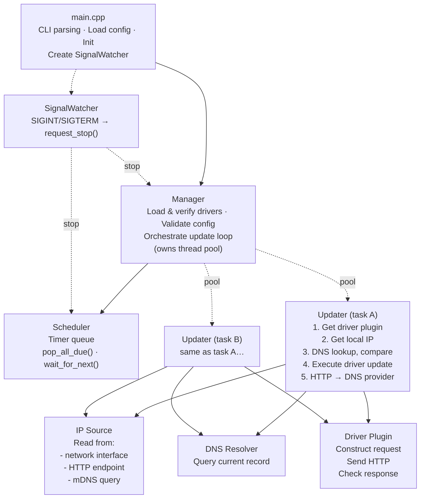

# yaddnsc — Yet Another Dynamic DNS Client

[](https://opensource.org/licenses/MIT)
[](https://github.com/CyberKoo/yaddnsc/actions/workflows/ci.yml)
[](https://en.cppreference.com/w/cpp/23)
[](https://codecov.io/github/CyberKoo/yaddnsc)
[]()
[]()
[]()

> **⚠️ Warning:** The `master` branch (v1.x) is under heavy development. The v1 ABI has not yet been finalized and may change significantly — plugins **must** be recompiled after each update.

**yaddnsc** is a modern Dynamic DNS (DDNS) client that monitors your local IP addresses and automatically updates DNS records on supported DNS providers when changes are detected. It is designed to be lightweight, modular, and extensible through a plugin-based driver system.

## Features

- **Multi-domain, multi-subdomain management** — manage multiple domains and subdomains from a single configuration file.
- **Pluggable driver architecture** — drivers are loaded as shared libraries (`.so`) at runtime. See [DRIVERS.md](DRIVERS.md) for the list of bundled drivers, their parameters, and how to write custom ones
- **Flexible IP source configuration** — each subdomain can choose from:
  - `interface` — obtain the IP from a local network interface
  - `http` — obtain the IP from an external HTTP service (e.g. `https://ifconfig.me`)
  - `mdns` — discover a LAN device's IP address via mDNS (RFC 6762, e.g. `printer.local`)
- **Per-subdomain update interval** — each subdomain can override the domain-level update interval.
- **Cooperative request cancellation** — DNS lookups and HTTP requests are cancellable mid-flight. When a faster resolver answers first or the dispatcher shuts down, pending requests are interrupted immediately rather than waiting for timeout.
- **IPv4 and IPv6 support** — configure A and AAAA records independently.
- **Custom DNS resolver** — optionally use specific DNS servers instead of the system resolver. Supports **traditional DNS**, **DNS-over-HTTPS (DoH)**, and **DNS-over-TLS (DoT)** with configurable query strategies.
- **Forced update scheduling** — periodically force-update DNS records even when the IP hasn't changed.
- **Graceful shutdown** — handles SIGINT/SIGTERM.
- **Thread-pool-based concurrency** — subdomain updates are dispatched to a thread pool for parallel execution.
- **Build identity verification** — a compiler identity hash (FNV-1a 64-bit) is embedded in both the host binary and every driver plugin at compile time, preventing ABI mismatches from incompatible toolchains. The `yaddnsc info` CLI command displays the full build configuration.
- **Configuration validation on startup** — the loaded drivers and network interfaces are validated against the configuration before the update loop begins, catching misconfigurations early.
- **C++23** — better performance, safer and more reliable code, fewer external dependencies.
- **Cross-platform** — runs on all major POSIX platforms: Linux (glibc and musl), macOS, and FreeBSD. Continuously validated via CI on Linux (glibc) and macOS (arm64).

## Architecture Overview



## Build Requirements

### Prerequisites

| Tool / Library  | Minimum Version                                    |
|-----------------|----------------------------------------------------|
| OS              | POSIX (Linux, macOS, *BSD)                         |
| CMake           | 3.28                                               |
| C++ Compiler    | C++23 capable (GCC 14+, Clang 19+, Apple Clang 15+) |
| OpenSSL         | 3.0+                                               |
| pkg-config      | Any (required on Linux; optional on macOS)         |

### Building

```bash
# Install system dependencies (Debian/Ubuntu)
sudo apt install libssl-dev build-essential cmake pkg-config

# Install system dependencies (macOS)
brew install openssl@3 cmake pkg-config

# Default build (Debug — includes debug symbols and sanitizers)
cmake -B build
cmake --build build -j$(nproc)

# Optimized production build
cmake -B build -DCMAKE_BUILD_TYPE=Release
cmake --build build -j$(nproc)

# Install to a staging directory
cmake --install build --prefix /usr --sysconfdir /etc

# Or install system-wide (DESTDIR support for packages)
sudo cmake --install build
```

### Platform Notes

**Legacy devices** — If your toolchain is older (GCC < 14 or Clang < 19), use the `v0.x` (legacy) branch (C++17, CMake 3.14+, OpenSSL 1.1.x). Maintenance-only; feature development happens on master.

**Alpine Linux (musl)** — musl lacks the reentrant `res_n*` resolver family; the native DNS stack (now the default on all platforms) handles this correctly. To fall back to libresolv, set `-DYADDNSC_USE_NATIVE_DNS=OFF`.

### Testing

Unit tests are available for utility, DNS protocol, validation, and configuration components.
Tests are gated by the `YADDNSC_BUILD_TESTS` CMake option (default: OFF). To build and run tests:

```bash
# Enable ASan-friendly options for local debugging (optional but recommended)
export ASAN_OPTIONS=detect_stack_use_after_return=1:strict_string_checks=1:detect_invalid_pointer_pairs=2

cmake -B build -DYADDNSC_BUILD_TESTS=ON
cmake --build build -j$(nproc)
ctest --test-dir build --output-on-failure
```

Integration tests for the core orchestration components (Manager, Scheduler, Updater) are planned after a planned refactoring decouples these with injectable interfaces.

### CMake Options

| Option                        | Default                                       | Description                                                       |
|-------------------------------|-----------------------------------------------|-------------------------------------------------------------------|
| `CMAKE_BUILD_TYPE`            | Debug                                         | Set to `Release` for optimized production builds                   |
| `YADDNSC_MIN_UPDATE_INTERVAL` | 60                                            | Minimum allowed update interval in seconds                         |
| `YADDNSC_USE_NATIVE_DNS`      | ON                                            | Use built-in DNS query and parser (no libresolv) for better portability. Set to OFF to fall back to system libresolv (DEPRECATED — will be removed before 1.0.0).
| `YADDNSC_DEFAULT_DNS_SERVER`  | 1.1.1.1                                       | Default DNS server address when none is configured                 |
| `YADDNSC_DEFAULT_DNS_PORT`    | 53                                            | Default DNS server port when none is configured                    |
| `YADDNSC_USE_SYSTEM_SPDLOG`   | OFF                                           | Use system spdlog instead of the bundled CPM-downloaded version    |
| `YADDNSC_BUILD_DOCS`          | OFF                                           | Build Doxygen API documentation from source comments               |
| `YADDNSC_BUILD_TESTS`         | OFF                                           | Build unit tests (requires GoogleTest, fetched via CPM.cmake)      |
| `YADDNSC_ENABLE_DEB`          | OFF                                           | Enable DEB package generation via CPack                            |

#### Building a DEB package

```bash
# Build locally
cmake -B build -DCMAKE_BUILD_TYPE=Release -DYADDNSC_ENABLE_DEB=ON
cmake --build build -j$(nproc)
cpack --config build/CPackConfig.cmake -G DEB

# Or use the Docker-based DEB builder (recommended for CI)
./docker/build-deb.sh          # builds for Ubuntu 24.04
./docker/build-deb.sh 24.04 26.04  # builds for multiple versions
```

#### Docker (multi-stage build)

A multi-stage Dockerfile (`Dockerfile`) is provided for building and running yaddnsc on Alpine Linux:

```bash
docker build -t yaddnsc .
docker run yaddnsc --help
```

The Docker build produces a minimal runtime image with only the required shared libraries (OpenSSL, zlib, brotli, libstdc++), a non-root user, and the binary pre-configured with a default config.

#### Doxygen API Documentation

API documentation can be generated from source comments using Doxygen:

```bash
cmake -B build -DCMAKE_BUILD_TYPE=Release -DYADDNSC_BUILD_DOCS=ON
cmake --build build -j$(nproc)
make -C build doxygen   # generates HTML docs in build/docs/
```

Requires `doxygen` and optionally `graphviz` (for diagrams).

Third-party dependencies are fetched automatically via [CPM.cmake](https://github.com/cpm-cmake/CPM.cmake) (v0.40+). Each dependency is pinned to an explicit, immutable version tag (e.g. `@2.6.2`) so builds are reproducible; floating branches or mutable tags are never used.

> **Why CPM?** CPM wraps CMake's `FetchContent` and lets us pin every third-party
> library to a fixed version with a single declarative call, avoiding a system-wide
> install step and keeping the dependency set small and auditable.
>
> **Known limitations** (mitigated by keeping the dependency set small and performing
> periodic manual vulnerability reviews):
> - No binary caching — every clean build recompiles dependencies.
> - No transitive dependency resolution — versions must be declared explicitly.
> - No centralized security advisory registry — CVEs are tracked manually.

### Debug sanitizers

Debug builds enable AddressSanitizer + UndefinedBehaviorSanitizer by default
(gated by `YADDNSC_SANITIZE_DEBUG`, default ON). To get the most out of ASan during
local debugging, export the following before running the binary:

```bash
export ASAN_OPTIONS=detect_stack_use_after_return=1:strict_string_checks=1:detect_invalid_pointer_pairs=2
```

The full sanitizer combination (integer, bounds, null, alignment, plus aggressive
use-after-return/use-after-scope modes) is **not** applied to Debug builds — it is
reserved for the dedicated `Sanitizer` build type used in CI for periodic deep
testing, since it is extremely expensive and triggers many false positives against
STL internals.

### Conversion warning gate

The `-Wconversion` and `-Wsign-conversion` warnings conflict heavily with the
standard library and common idioms, so they are **not** enabled on every local
build. They run only as a dedicated CI job (`conversion-gate`) to catch narrowing
bugs before merge while keeping developer velocity high.

## Driver ABI Verification

yaddnsc loads driver plugins as shared libraries (`.so`) at runtime via `dlopen`.
Because C++ has no stable ABI across compilers, the same code compiled with
different toolchains can produce incompatible binaries. To catch such mismatches
early, every driver undergoes a three-layer verification before its code is ever
executed.

### Build ID (Compiler Fingerprint)

At CMake configure time, the build system captures the compiler identity and
embeds it into every compiled translation unit via a generated header
(`build_id.hpp`, from `template/headers/build_id.hpp.in`):

- **Compiler identity fields**: `COMPILER_ID`, `COMPILER_VERSION`, `BUILD_TYPE`,
  the detected C++ standard library (`COMPILER_ABI` — `libc++` or `libstdc++`),
  and the C standard library (`LIBC_TYPE` — `glibc` or `musl`).
- **FNV-1a 64-bit hash** (`COMPILER_ID_HASH`): A compile-time hash of all
  compiler identity fields combined, used for fast ABI compatibility checks.
- **Human-readable build ID string** (`full_id()`), e.g. `"GNU 14.2.0 Release"`.

The `DEFINE_DRIVER_FACTORY` macro (used in every driver, see
[Writing a Custom Driver](#writing-a-custom-driver)) automatically exports the
hash and build ID string from the driver `.so`, so they can be checked by the
host at load time.

### Three-Layer Load-Time Verification

When the host loads a driver `.so` via `dlopen`, it performs the following
checks in order, before any driver code is executed:

1. **Magic check** — Calls `yaddnsc_drv_magic()` and verifies the returned
   constant matches `YADDNSC_DRIVER_MAGIC` (`0x594144444E534300ULL`).
   This confirms the `.so` is indeed a yaddnsc driver, not an arbitrary shared
   library.

2. **Compiler identity check** — Calls `yaddnsc_drv_compiler_id_hash()` and
   compares the returned value with the host's `BuildId::COMPILER_ID_HASH`.
   A mismatch means the driver was compiled with a different toolchain
   (different compiler vendor, version, or C++ standard library ABI flag).
   The driver is rejected with a clear error message:
   ```
   Driver 'cloudflare.so' compiler identity mismatch: 0xABCD… != 0x1234…
   Rebuild the driver with the same toolchain and flags as the host.
   ```

3. **ABI version check** — After the driver is instantiated, its
   `get_abi_version()` is compared against the host's `DRV_ABI_VERSION`.
   This ensures the virtual function table layout of the `Driver` interface
   is compatible.

This layered design catches ABI issues at load time, before any DNS update
operation is attempted.

### Inspecting Build Configuration

The `yaddnsc info` CLI command displays the current binary's build configuration,
including the compiler identity hash, ABI variant, and C++ standard level:

```bash
$ yaddnsc info
Build configuration:
  Version              v1.0.0
  Build ID             GNU 14.2.0 Release
  C library            glibc
  Compiler ABI         libstdc++ (_GLIBCXX_USE_CXX11_ABI=1)
  Compiler ID hash     0xABCDEF0123456789
  C++ standard         C++23
  DNS resolver         System (libresolv)
  Default DNS          1.1.1.1:53
  Min update interval  60s
  Format library       std::format
  spdlog               bundled
```

### Building Drivers from Source

The safest way to avoid ABI mismatches is to compile your driver together with
the yaddnsc source tree. The `driver/` CMakeLists.txt automatically discovers
subdirectories and builds everything with the same compiler flags and settings
as the host binary:

```bash
# Add your driver source to driver/<your_driver>/
# Then rebuild:
cmake -B build
cmake --build build -j$(nproc)
```

If you must build as a standalone shared library, ensure:
- The compiler, version, and C++ standard (C++23, GCC 14+, Clang 19+,
  Apple Clang 15+) match the host build exactly.
- The same `AbiVersion` is used (defined by the generated `driver_ver.h`).
- The `DEFINE_DRIVER_FACTORY` macro derives the compiler identity hash
  automatically — as long as the same toolchain is used, it will match.
- Build as a `MODULE` library (position-independent code, no `lib` prefix).

> **Note:** Even with matching compiler identity, minor version differences
> or different `_GLIBCXX_USE_CXX11_ABI` settings can still produce incompatible
> binaries. When in doubt, always build from source.

## Configuration

yaddnsc uses a JSON configuration file. By default it looks for `./config.json`, or you can specify a custom path with the `-c` flag.

A template configuration is generated at build time from `template/deb/yaddnsc_config.json` and installed to the system config directory (`${sysconfdir}/yaddnsc/config.json`).

### Example Configuration

```json
{
  "driver": {
    "driver_dir": "/opt/yaddnsc/drivers",
    "auto_discover": false,
    "load": [
      "cloudflare.so",
      "simple.so"
    ]
  },
  "resolver": {
    "use_custom_server": false,
    "strategy": "concurrent",
    "servers": [
      { "address": "1.1.1.1", "port": 53 },
      { "address": "8.8.8.8", "port": 53 }
    ]
  },
  "domains": [
    {
      "name": "example.com",
      "update_interval": 300,
      "force_update": 0,
      "driver": "cloudflare",
      "subdomains": [
        {
          "name": "home",
          "type": "aaaa",
          "interface": "eth0",
          "ip_source": "interface",
          "allow_ula": false,
          "allow_local_link": false,
          "update_interval": 600,
          "driver_param": {
            "zone_id": "your-zone-id",
            "record_id": "your-record-id",
            "token": "your-api-token"
          }
        },
        {
          "name": "home",
          "type": "a",
          "ip_source": "http",
          "ip_source_param": "https://ipv4.example.com/",
          "allow_ula": false,
          "allow_local_link": false,
          "driver_param": {
            "zone_id": "your-zone-id",
            "record_id": "your-record-id",
            "token": "your-api-token"
          }
        }
      ]
    }
  ]
}
```

### Configuration Reference

#### Top-level

| Field      | Type     | Description                                   |
|------------|----------|-----------------------------------------------|
| `driver`   | object   | Driver loading configuration                  |
| `resolver` | object   | Custom DNS resolver settings (optional)       |
| `domains`  | array    | List of domain configurations                 |

#### `driver` object

| Field           | Type     | Description                                                                            |
|-----------------|----------|----------------------------------------------------------------------------------------|
| `driver_dir`    | string   | Directory containing driver `.so` files. **Optional** — when omitted, defaults to `${libdir}/yaddnsc/drivers` (e.g. `/usr/lib/yaddnsc/drivers`) |
| `auto_discover` | boolean  | If true, automatically loads all `.so` files in `driver_dir` (ignores `load` list). Default: `true` |
| `load`          | string[] | List of driver shared library filenames to load (ignored when `auto_discover` is true) |

#### `resolver` object

| Field               | Type        | Description                                                                                                                                   |
|---------------------|-------------|-----------------------------------------------------------------------------------------------------------------------------------------------|
| `use_custom_server` | boolean     | If true, use the specified DNS server(s) instead of system                                                                                    |
| `servers`           | object[]    | List of DNS servers. See [DNS Resolver](#dns-resolver) for supported address formats.                                                         |
| `address`           | string      | **Deprecated, will be removed in a future release.** DNS server address specified directly at the resolver level. Use `servers` instead. |
| `ipaddress`         | string      | **Deprecated, will be removed in a future release.** Alias for `address`. Use `servers` instead. |
| `port`              | int         | **Deprecated, will be removed in a future release.** Port for use with `address` (default: 53). Use `servers` instead. |
| `strategy`          | string      | Query strategy: `"concurrent"` (default) or `"fallback"`. See [DNS Resolver](#dns-resolver). |

#### `DnsServer` object

| Field        | Type   | Description                                                                                           |
|--------------|--------|-------------------------------------------------------------------------------------------------------|
| `address`    | string | DNS server address.                                                                                   |
| `ipaddress`  | string | **Deprecated, will be removed in a future release.** Alias for `address`.                              |
| `port`       | int    | Port number (default: 53). **Only used by the traditional DNS resolver.** DoH/DoT resolvers ignore this
field and read the port from the `address` URI instead.                                            |

> See [DNS Resolver](#dns-resolver) for supported `address` formats (traditional DNS, DoH, DoT).

#### `domains[]` object

| Field             | Type   | Description                                                                                 |
|-------------------|--------|---------------------------------------------------------------------------------------------|
| `name`            | string | Domain name (e.g. `example.com`)                                                            |
| `update_interval` | int    | Interval in seconds between updates (minimum: 60). Used as default for all subdomains.      |
| `force_update`    | int    | Interval in seconds for forced updates (0 = disabled). Must be >= `update_interval` if set. |
| `driver`          | string | Name of the driver to use (must match a loaded driver)                                      |
| `subdomains`      | array  | List of subdomain records to manage                                                         |

#### `subdomains[]` object

| Field              | Type    | Description                                                                                                          |
|--------------------|---------|----------------------------------------------------------------------------------------------------------------------|
| `name`             | string  | Subdomain name (e.g. `home` for `home.example.com`)                                                                  |
| `type`             | string  | DNS record type: `"a"`, `"aaaa"`, `"txt"`, or `"soa"`. Determines address family automatically (A → IPv4, AAAA → IPv6). |
| `interface`        | string  | Network interface name (e.g. `eth0`). Required for `"interface"` IP source; optional for others.                     |
| `ip_source`        | string  | IP source strategy: `"interface"`, `"http"`, or `"mdns"`. `"url"` is the old name for `"http"` (deprecated, will be removed in a future release). See [IP Source](#ip-source) for details. |
| `ip_source_param`  | string  | Source-specific parameter (URL for `"http"`, mDNS hostname for `"mdns"`). Ignored for `"interface"`.                  |
| `allow_ula`        | boolean | When using IPv6 interface source, allow Unique Local Addresses (default: false)                                      |
| `allow_local_link` | boolean | When using IPv6 interface source, allow link-local addresses (default: false)                                        |
| `update_interval`  | int     | Per-subdomain update interval in seconds (optional). 0 or omitted = inherit from `domain.update_interval`.           |
| `driver_param`     | object  | Driver-specific parameters (key-value map)                                                                           |

## IP Source

The `ip_source` field in a `subdomains[]` entry determines how yaddnsc discovers the IP address to update. Three sources are supported:

### `interface` — Read from a local network interface

Reads the IP address directly from a specified local network interface. Ideal for devices with a static local address or when you want to report the address bound to a specific interface.

```json
{
    "name": "home",
    "type": "a",
    "interface": "eth0",
    "ip_source": "interface"
}
```

### `http` — Fetch from an HTTP(S) endpoint

Fetches the IP address from an external HTTP(S) service that returns the client's IP in the response body (e.g. `https://api.ipify.org`). The HTTP request can be bound to a specific interface.

```json
{
    "name": "home",
    "type": "a",
    "interface": "eth0",
    "ip_source": "http",
    "ip_source_param": "https://api.ipify.org"
}
```

### `mdns` — Discover via mDNS (RFC 6762)

Discovers the IP address of a LAN device by sending a multicast DNS query for a `.local` hostname (e.g. `printer.local`). Useful for detecting the address of devices on the local network such as printers, NAS, or IoT devices.

```json
{
    "name": "printer",
    "type": "a",
    "ip_source": "mdns",
    "ip_source_param": "printer.local"
}
```

```json
{
    "name": "nas",
    "type": "aaaa",
    "interface": "eth0",
    "ip_source": "mdns",
    "ip_source_param": "nas.local"
}
```

## DNS Resolver

yaddnsc can use custom DNS servers for record lookups instead of the system resolver. Configure the `resolver` object at the top level of your configuration file. If no custom servers are configured, the built-in defaults (`1.1.1.1:53`) are used automatically.

Three resolver types are supported, auto-detected from the address format:

### Traditional DNS (UDP/TCP)

Uses standard DNS over UDP (or TCP for large responses) on a given IP and port. The underlying implementation is selectable at compile time:
- `YADDNSC_USE_NATIVE_DNS=ON` (default) — built-in raw UDP/TCP implementation (no libresolv)
- `YADDNSC_USE_NATIVE_DNS=OFF` — uses system libresolv for transport (`res_nquery`; **DEPRECATED** — will be removed before 1.0.0)

When `YADDNSC_USE_NATIVE_DNS=ON` (the default), DNS packet parsing is fully self-contained (no libresolv). In the `OFF` mode, both the resolver and parser depend on libresolv (`res_nquery` / `ns_initparse`). The native stack is now the default, providing better portability across platforms and full control over the transport layer. The system libresolv backend is **deprecated** and will be removed before the 1.0.0 release.

```json
{
  "resolver": {
    "use_custom_server": true,
    "servers": [
      { "address": "1.1.1.1", "port": 53 },
      { "address": "8.8.8.8", "port": 53 }
    ]
  }
}
```

### DNS-over-HTTPS (DoH)

- **RFC 8484** — DNS queries via HTTPS POST; the address must be a complete HTTPS URL including path (e.g. `https://1.1.1.1/dns-query`)
- Cooperative request cancellation
- **Port in URI** — The DoH resolver reads the port from the URI (e.g. `https://1.1.1.1:1443/dns-query`). The `port` field in the DnsServer object is **ignored**. If no port is specified in the URI, the default is `443`.

```json
{
  "resolver": {
    "use_custom_server": true,
    "servers": [
      { "address": "https://1.1.1.1/dns-query" },
      { "address": "https://cloudflare-dns.com/dns-query" }
    ]
  }
}
```

### DNS-over-TLS (DoT)

- **RFC 7858** — DNS queries via TLS; the address is in `tls://` URI format
- **RFC 7830** — EDNS(0) padding
- **RFC 6066** — TLS SNI extension
- **RFC 7301** — TLS ALPN extension
- Cooperative request cancellation
- **Port in URI** — The DoT resolver reads the port from the URI (e.g. `tls://1.1.1.1:853`). The `port` field in the DnsServer object is **ignored**. If no port is specified in the URI, the default is `853`.

```json
{
  "resolver": {
    "use_custom_server": true,
    "servers": [
      { "address": "tls://1.1.1.1:853" }
    ]
  }
}
```

### Query Strategy

The `strategy` field controls how multiple DNS servers are queried:

| Strategy     | Behaviour                                                                 |
|--------------|---------------------------------------------------------------------------|
| `concurrent` | **(Default)** Fire resolvers in batches of 3 in parallel and return the fastest successful response. |
| `fallback`   | Try the first resolver; if it fails, try the next one in order.           |

```json
{
  "resolver": {
    "use_custom_server": true,
    "strategy": "fallback",
    "servers": [
      { "address": "https://1.1.1.1/dns-query" },
      { "address": "tls://1.1.1.1" }
    ]
  }
}
```

## Driver Parameters

See [DRIVERS.md](DRIVERS.md) for the complete reference of all bundled driver parameters, including configuration tables, available substitution variables, and usage examples.

## Usage

```bash
# Run the DDNS client (default config path: ./config.json)
yaddnsc run

# Run with a specific config file and verbose logging
yaddnsc run -c /etc/yaddnsc/config.json -d

# Validate configuration and exit
yaddnsc config test

# Validate configuration quietly (exit code only)
yaddnsc config test -q
yaddnsc config test --quiet

# Print resolved configuration as JSON
yaddnsc config show

# List loaded drivers
yaddnsc driver list

# Show driver details
yaddnsc driver info <name>

# List network interfaces
yaddnsc interface list

# Show IP addresses of a specific interface
yaddnsc interface ip <name>

# DNS resolve a hostname
yaddnsc dns resolve <hostname> [--type A|AAAA|TXT|SOA]

# Show configured DNS resolver details
yaddnsc dns resolver

# Show build configuration (version, compiler, ABI, ID hash, etc.)
yaddnsc info

# Print version
yaddnsc --version

# Print help
yaddnsc --help
yaddnsc <subcommand> --help
```

### Systemd Service

A systemd service file is provided (generated at build time from `template/deb/yaddnsc.service.in`) and installed automatically by `cmake --install` when systemd is detected. It features configuration validation (`config test`) before every start, security hardening (DynamicUser, ProtectSystem, ProtectHome), and optional overrides via an environment file in the system config directory:

```bash
# Install normally — the service is placed automatically
sudo cmake --install build

# Enable and start the service
sudo systemctl daemon-reload
sudo systemctl enable --now yaddnsc

# Optional: override config path
sudo mkdir -p /etc/yaddnsc/default
echo 'YADDNSC_CONFIG=/custom/path/config.json' | sudo tee /etc/yaddnsc/default/yaddnsc
```

> **Note:** The service file uses `cmake`-substituted paths at build time, so the binary, config, and environment file locations are determined by the `CMAKE_INSTALL_BINDIR` and `CMAKE_INSTALL_SYSCONFDIR` variables passed during configuration.

## Writing a Custom Driver

Drivers are shared libraries loaded at runtime. To write one:

1. Include `driver/base.h` and inherit from `BaseDriver`.
2. Implement the `Driver` interface:
   - `generate_request(config, ctx)` — construct a `DriverRequestContext` (containing URL and `DriverRequest` with HTTP method, headers, body)
   - `check_response(response)` — validate the API response body
   - `get_detail()` — return driver metadata (name, description, author, version)
   - `get_abi_version()` — ABI version check (already `final` in `BaseDriver`, no override needed)
   - `execute(config, ctx, http)` — drive the full update workflow (default provided by `BaseDriver`, override for multi-step workflows)
3. Use the `DEFINE_DRIVER_FACTORY(YourDriverClass)` macro at the bottom of the
   implementation file. This macro exports five C entry points required by the
   host's load-time verification (see [Driver ABI Verification](#driver-abi-verification)):
   - `create()` / `destroy()` — standard factory functions
   - `yaddnsc_drv_magic()` — driver magic constant
   - `yaddnsc_drv_compiler_id_hash()` — FNV-1a 64-bit compiler identity hash
   - `yaddnsc_drv_build_id_str()` — human-readable build ID string

> **Recommendation:** Compile your custom driver **together with the yaddnsc
> source tree** rather than as a standalone build.  The `driver/` CMakeLists.txt
> automatically discovers subdirectories and builds with the same flags as the
> host, guaranteeing ABI compatibility.  See
> [Building Drivers from Source](#building-drivers-from-source) for details.

## Dependencies

| Library                                                     | Purpose                                        | Management   |
|-------------------------------------------------------------|------------------------------------------------|--------------|
| [glaze](https://github.com/stephenberry/glaze)              | JSON serialization/reflection                  | CPM.cmake    |
| [spdlog](https://github.com/gabime/spdlog)                  | Logging                                        | CPM.cmake    |
| [cpp-httplib](https://github.com/yhirose/cpp-httplib)       | HTTP client                                    | CPM.cmake    |
| [CLI11](https://github.com/CLIUtils/CLI11)                   | CLI option parsing                             | CPM.cmake    |
| [BS::thread_pool](https://github.com/bshoshany/thread-pool) | Thread pool                                    | CPM.cmake    |
| [fmt](https://github.com/fmtlib/fmt)                        | String formatting (fallback if no std::format) | CPM.cmake    |
| [magic_enum](https://github.com/Neargye/magic_enum)         | Static enum reflection                         | CPM.cmake    |
| [picohttpparser](https://github.com/h2o/picohttpparser)     | HTTP request/response parsing (cpp-httplib lacks request cancellation) | CPM.cmake    |
| OpenSSL                                                     | TLS support                                    | System       |

## License

This project is licensed under the terms specified in the [LICENSE](LICENSE) file.
