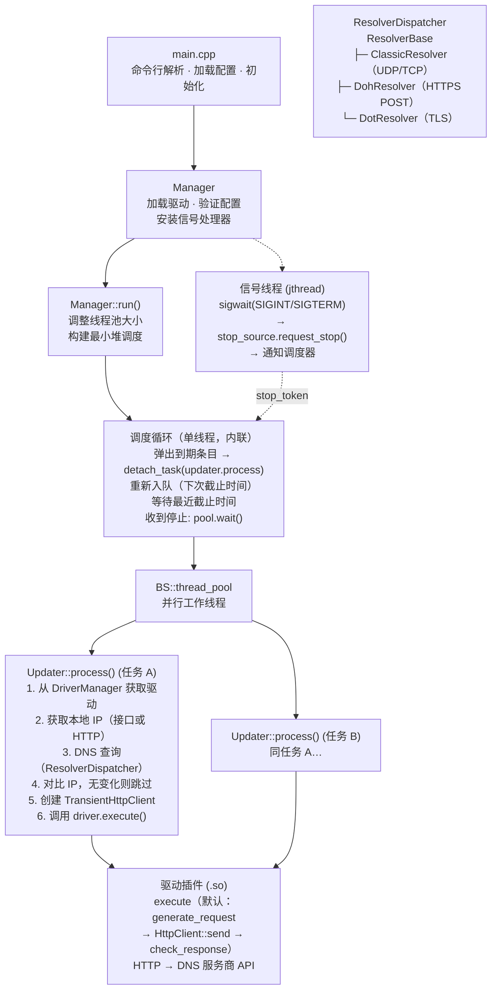

# yaddnsc — Yet Another Dynamic DNS Client
**yaddnsc** 是一个基于 C++23 的现代动态 DNS（DDNS）客户端。它监控本机 IP 地址的变化，并通过插件式驱动架构自动更新支持的 DNS 服务商上的域名解析记录。

## 功能特性

- **多域名、多子域名管理** — 单个配置文件即可管理多个域名及其子域名。
- **插件化驱动架构** — 驱动以共享库（`.so`）形式在运行时通过 `dlopen` 动态加载。内置驱动：
  - [Cloudflare](https://www.cloudflare.com/) — 通过 Cloudflare API v4 更新 DNS 记录
  - [DigitalOcean](https://www.digitalocean.com/) — 通过 DigitalOcean API v2 更新 DNS 记录
  - [DNSPod](https://www.dnspod.com/) — 通过 DNSPod API 更新 DNS 记录（同时支持国内和国际端点）
  - [Simple](https://github.com/Kotarou/yaddnsc) — 通用 HTTP 驱动，支持 URL 模板替换，适用于自定义 API
- **灵活的 IP 来源配置** — 每个子域名可独立选择：
  - `interface` — 从本地网卡获取 IP 地址
  - `http` — 从外部 HTTP 服务获取 IP 地址（如 `https://ifconfig.me`）
  - `mdns` — 通过 mDNS（RFC 6762）发现局域网设备的 IP 地址（如 `printer.local`）
- **子域名级更新间隔** — 每个子域名可单独设置更新间隔，不设置则继承域名级别配置。
- **IPv4 和 IPv6 支持** — 可独立配置 A 和 AAAA 记录。
- **自定义 DNS 解析器** — 可选使用特定 DNS 服务器代替系统默认解析器。支持**传统 DNS**（纯 IP + 端口）、**DNS-over-HTTPS (DoH)**（完整 HTTPS URL，如 `https://1.1.1.1/dns-query`）和 **DNS-over-TLS (DoT)**（`tls://` 协议 URI，如 `tls://1.1.1.1`）。支持可配置的查询策略——**fallback**（依次尝试解析器，失败时切换到下一个）或 **concurrent**（同时向所有配置的解析器发起查询，取最快成功响应）。
- **强制更新调度** — 即使 IP 未发生变化，也可按设定周期强制更新 DNS 记录。
- **优雅退出** — 通过专用信号处理线程捕获 SIGINT/SIGTERM，使用 stop_token 安全停止所有任务。
- **线程池并发** — 子域名更新任务通过 `BS::thread_pool` 并行执行。
- **C++23 标准** — 使用现代 C++，基于 `std::format`（或回退到 fmt 库）和 `std::jthread`。
- **跨平台** — CI 自动构建覆盖 Linux（Ubuntu）和 macOS。

## 架构概览



**线程模型：** 单调度器线程（内联在 `Manager::run()` 中）维护一个 `SubdomainEntry` 最小堆（按截止时间排序）。子域名到期时，调度器将其弹出堆，将 `Updater::process(task)` 提交到共享线程池，然后以新的截止时间重新入队。调度器在条件变量上等待，直到最近截止时间或收到停止请求。关闭时等待线程池中所有任务完成后再返回。

**信号处理：** 专用 `std::jthread` 在 `sigwait()` 上等待 `SIGINT`/`SIGTERM`。收到信号后调用 `stop_source.request_stop()`，触发 `std::stop_callback` 通知调度器的条件变量，唤醒循环使其跳出并排空线程池。

**Updater::process()**（在线程池中执行）对每个子域名依次执行：

1. **解析驱动** — 从 `DriverManager` 按名称查找驱动插件。
2. **获取本地 IP** — 通过 IP 来源抽象层（`IpSourceBase`）解析，从本地网卡读取（`InterfaceIpSource`）或从外部 URL 获取（`HttpIpSource`）。由 `IpSourceFactory` 根据子域名配置自动创建对应的实现。
3. **DNS 查询** — 使用 `ClassicResolver`（UDP/TCP）、`DohResolver`（HTTPS POST, RFC 8484）或 `DotResolver`（TLS, RFC 7858）查询当前 DNS 记录。
4. **对比** — IP 无变化则跳过更新（除非设置了 `force_update`）。
5. **创建 `TransientHttpClient`** — 为每个任务创建新的 httplib::Client 实例。
6. **调用 `driver.execute()`** — 委托给驱动插件，执行 `generate_request()` → `HttpClient::send()` → `check_response()`。

**HTTP 抽象层：** 所有服务商 API 通信均通过 `HttpClient` 接口进行。两个具体实现：`TransientHttpClient` 每次请求创建新的 [cpp-httplib](https://github.com/yhirose/cpp-httplib) 客户端（更新器使用），`PersistentHttpClient` 在多次调用间复用单一连接（DoH 解析器内部使用）。地址族和网络接口通过 `HttpClientOptions` 按子域名配置。

## 构建要求

### 前置依赖

| 工具/库    | 最低版本     |
|---------|----------|
| CMake   | 3.28     |
| C++ 编译器 | 支持 C++23 |
| OpenSSL | 3.0+ |
| Zlib    | 任意较新版本   |

yaddnsc 仅支持 POSIX 系统。支持的编译器：GCC 14+、Clang 18+、Apple Clang 15+

### 编译方法

```bash
# 安装系统依赖（Debian/Ubuntu）
sudo apt install libssl-dev zlib1g-dev build-essential cmake

# 安装系统依赖（macOS）
brew install openssl@3 cmake

# 编译
mkdir build && cd build
cmake .. -DCMAKE_BUILD_TYPE=Release
make -j$(nproc)

# 主程序位于 build/objs/yaddnsc
# 驱动模块位于 build/objs/drivers/*.so
```

### 平台注意事项

**编译器版本不满足要求**

当前分支需要 **GCC 14+** 或 **Clang 18+**（C++23）。如果工具链版本过低，
请使用 `v0.x`（legacy）分支：

|                | master（当前分支）       | v0.x（legacy）         |
|----------------|----------------------|-----------------------|
| C++ 标准        | C++23                | C++17                 |
| 编译器          | GCC 14+ / Clang 18+  | GCC 9+ / Clang 10+    |
| CMake          | 3.28+                | 3.14+                 |
| OpenSSL        | 3.0+                 | 1.1.x                 |

legacy 分支处于维护模式，不会添加新功能，但会修复关键 bug。该分支也支持
DoT/DoH 解析器。

**Alpine Linux**

musl 提供的是降级版的经典 `resolv` stub，缺少现代特性，且与 glibc 的
解析器相比存在性能瓶颈和功能限制。强烈建议在 Alpine 上将解析器配置为
使用 **DoT**（DNS over TLS）或 **DoH**（DNS over HTTPS），而非系统解析器。

### CMake 选项

| 选项                            | 默认值                                           | 说明                              |
|-------------------------------|-----------------------------------------------|---------------------------------|
| `CMAKE_BUILD_TYPE`            | Release                                       | 设为 `Debug` 可生成调试版本              |
| `YADDNSC_LOGGING_PATTERN`     | `[%D %T.%e] [%^%8l%$] [%8!t] [%15!s:%-4#] %v` | 传递给 spdlog::set_pattern() 的日志格式 |
| `YADDNSC_MIN_UPDATE_INTERVAL` | 60                                            | 最小允许的更新间隔（秒），不能为负数              |
| `YADDNSC_MANUAL_MKQUERY`      | OFF                                          | 使用自包含的手动 DNS 查询构建器代替系统 `res_mkquery()`。当系统 stub 实现不完整或不理想时启用（例如避免解析器配置中的 EDNS0 记录）。 |
| `YADDNSC_USE_SYSTEM_SPDLOG`   | OFF                                          | 使用系统包提供的 spdlog 代替 CPM 自动下载的版本。启用时也会使用系统提供的 fmt 库。 |

第三方依赖（glaze、spdlog、cpp-httplib、CLI11、BS::thread_pool、fmt、magic_enum）通过 CPM.cmake 自动下载。

## 配置文件说明

yaddnsc 使用 JSON 格式的配置文件。默认查找 `./config.json`，可通过 `-c` 参数指定其他路径。

模板配置文件见 `config.example.json`。

### 配置示例

```json
{
  "driver": {
    "driver_dir": "/opt/yaddnsc/drivers",
    "auto_discover": false,
    "load": [
      "cloudflare.so",
      "simple.so"
    ]
  },
  "resolver": {
    "use_custom_server": false,
    "strategy": "concurrent",
    "servers": [
      { "address": "1.1.1.1", "port": 53 },
      { "address": "8.8.8.8", "port": 53 }
    ]
  },
  "domains": [
    {
      "name": "example.com",
      "update_interval": 300,
      "force_update": 0,
      "driver": "cloudflare",
      "subdomains": [
        {
          "name": "home",
          "type": "aaaa",
          "interface": "eth0",
          "ip_type": "ipv6",
          "ip_source": "interface",
          "ip_source_param": "",
          "allow_ula": false,
          "allow_local_link": false,
          "update_interval": 600,
          "driver_param": {
            "zone_id": "your-zone-id",
            "record_id": "your-record-id",
            "token": "your-api-token"
          }
        },
        {
          "name": "home",
          "type": "a",
          "ip_type": "ipv4",
          "ip_source": "http",
          "ip_source_param": "https://ipv4.example.com/",
          "allow_ula": false,
          "allow_local_link": false,
          "driver_param": {
            "zone_id": "your-zone-id",
            "record_id": "your-record-id",
            "token": "your-api-token"
          }
        }
      ]
    }
  ]
}
```

> **DoH 示例：** 要使用 DNS-over-HTTPS，将服务器地址设置为完整的 HTTPS URL（含路径）：
>
> ```json
> {
>   "servers": [
>     { "address": "https://1.1.1.1/dns-query" },
>     { "address": "https://cloudflare-dns.com/dns-query" }
>   ]
> }
> ```
>
> 地址必须以 `https://` 开头并包含完整路径（标准为 `/dns-query`，遵循 RFC 8484）。代码**不会**自动追加 `/dns-query`。DoH 模式下 `port` 字段被忽略。

### 配置字段参考

#### 顶层字段

| 字段         | 类型     | 说明                |
|------------|--------|-------------------|
| `driver`   | object | 驱动加载配置            |
| `resolver` | object | 自定义 DNS 解析器设置（可选） |
| `domains`  | array  | 域名配置列表            |

#### `driver` 对象

| 字段              | 类型       | 说明                                                   |
|-----------------|----------|------------------------------------------------------|
| `driver_dir`    | string   | 驱动 `.so` 文件所在目录                                      |
| `auto_discover` | boolean  | 为 true 时自动加载 `driver_dir` 下所有 `.so` 文件（忽略 `load` 列表） |
| `load`          | string[] | 需要加载的驱动共享库文件名列表（`auto_discover` 为 true 时忽略）          |

#### `resolver` 对象

| 字段                  | 类型          | 说明                                                                                                             |
|---------------------|-------------|----------------------------------------------------------------------------------------------------------------|
| `use_custom_server` | boolean     | 为 true 时使用指定的 DNS 服务器                                                                                          |
| `address`           | string      | DNS 服务器地址（旧字段，仅当 `servers` 为空时生效）。传统 DNS 使用纯 IP 地址。**DoH** 请使用完整的 HTTPS URL，含路径（如 `https://1.1.1.1/dns-query`）。**DoT** 请使用 `tls://` URI（如 `tls://1.1.1.1`）。 |
| `port`              | integer     | DNS 服务器端口，通常为 53（旧字段，仅当 `servers` 为空时生效）。当 `address` 为 HTTPS URL 或 `tls://` URI 时忽略。                                        |
| `servers`           | DnsServer[] | DNS 服务器列表，用于冗余容灾。每项包含 `address`（字符串）和 `port`（整数，默认 53）字段。                                                   |
| `strategy`          | string      | 解析器查询策略：`"concurrent"`（默认——并发查询所有服务器，取最快成功响应）或 `"fallback"`（依次尝试，失败时切换到下一个）。                           |

`servers` 数组中每个 `DnsServer` 项的结构如下：

| 字段        | 类型      | 说明                                                                                                                                |
|-----------|---------|-----------------------------------------------------------------------------------------------------------------------------------|
| `address` / `ipaddress` | string  | **传统 DNS**：纯 IP 地址（如 `1.1.1.1`）。**DNS-over-HTTPS (DoH)**：完整的 HTTPS URL，**包含路径**，例如 `https://1.1.1.1/dns-query`。必须以 `https://` 开头。**DNS-over-TLS (DoT)**：`tls://` URI（如 `tls://1.1.1.1`）。此字段也可写作 `ipaddress` 以兼容旧配置。 |
| `port`    | integer | DNS 服务器端口，通常为 53。**DoH 忽略此字段**（HTTPS 默认使用 443 端口），**DoT 同样忽略**（TLS 默认使用 853 端口）。                                                                                |

> **DoH / DoT 说明：** 当 `address` 以 `https://` 开头时，视为 DNS-over-HTTPS 解析器。地址必须是完整的 URL，包含完整路径——`/dns-query` 是 RFC 8484 定义的标准 DoH 端点，也支持任意自定义路径。代码**不会**自动追加 `/dns-query`，请确保配置完整。当 `address` 以 `tls://` 开头时，视为 DNS-over-TLS 解析器（RFC 7858）。未指定端口时默认使用 853。

当 `servers` 数组存在且非空时，`address` 和 `port` 被忽略。在不支持 `res_nquery()` 的平台（如某些 musl 构建）上，自定义服务器不可用，始终使用系统解析器。

> **IPv6 说明：** 传统 DNS 地址**不要**带方括号，例如 `"2606:4700:4700::1111"`。方括号用于 URI 字面量（如 `[::1]:53`），但 `inet_pton()` 解析时需要纯地址格式。

#### `domains[]` 对象

| 字段                | 类型     | 说明                                             |
|-------------------|--------|------------------------------------------------|
| `name`            | string | 域名（如 `example.com`）                            |
| `update_interval` | int    | 更新间隔，单位秒（最小值为 60）。作为所有子域名的默认值。                 |
| `force_update`    | int    | 强制更新间隔，单位秒（0 表示禁用）。如设置，必须 >= `update_interval` |
| `driver`          | string | 使用的驱动名称（必须与已加载的驱动匹配）                           |
| `subdomains`      | array  | 需要管理的子域名记录列表                                   |

#### `subdomains[]` 对象

| 字段                 | 类型      | 说明                                                                            |
|--------------------|---------|-------------------------------------------------------------------------------|
| `name`             | string  | 子域名名称（如 `home` 对应 `home.example.com`）                                         |
| `type`             | string  | DNS 记录类型：`"a"`、`"aaaa"`、`"txt"` 或 `"soa"`。自动决定地址族（A → IPv4，AAAA → IPv6）。 |
| `interface`        | string  | 网卡接口名称（如 `eth0`）。`"interface"` 和 `"http"` 两种 IP 来源为必填项；`"mdns"` 来源为可选项。 |
| `ip_type`          | string  | **已废弃——被忽略。** 地址族现在由 `type` 自动推导（A → IPv4，AAAA → IPv6）。 |
| `ip_source`        | string  | IP 来源：`"interface"`（从本地网卡读取）、`"http"`（通过 HTTP 获取）或 `"mdns"`（通过 mDNS / RFC 6762 发现）。`"url"` 也接受用于向后兼容。            |
| `ip_source_param`  | string  | 当 `ip_source` 为 `"http"` 时：HTTP(S) URL；当 `ip_source` 为 `"mdns"` 时：mDNS 主机名（如 `"printer.local"`）。`"interface"` 来源时忽略。                        |
| `allow_ula`        | boolean | 使用 IPv6 接口来源时，是否允许唯一本地地址（ULA），默认 false                                        |
| `allow_local_link` | boolean | 使用 IPv6 接口来源时，是否允许链路本地地址，默认 false                                             |
| `update_interval`  | int     | 子域名级更新间隔，单位秒（可选）。0 或省略 = 继承自 `domain.update_interval`                         |
| `driver_param`     | object  | 驱动特定参数（键值对）                                                                   |

> **注意：** `interface` 字段对 `"interface"` 和 `"http"` 来源为**必填项**，对 `"mdns"` 来源为**可选项**。`ip_source` 为 `"interface"` 时直接从网卡读取 IP；为 `"http"` 时 HTTP 请求绑定到该网卡以获取 IP；为 `"mdns"` 时 mDNS 查询通过该网卡发送（若指定了接口），否则走默认路由。

## 驱动参数说明

每个驱动需要在 `driver_param` 中设置特定参数。

### Cloudflare（`cloudflare.so`）

| 参数          | 必需 | 说明                                   |
|-------------|----|--------------------------------------|
| `zone_id`   | 是  | Cloudflare Zone ID                   |
| `record_id` | 是  | Cloudflare DNS 记录 ID                 |
| `token`     | 是  | Cloudflare API Token（需要 DNS:Edit 权限） |
| `proxied`   | 否  | 是否通过 Cloudflare 代理（CDN）              |
| `ttl`       | 否  | TTL，单位秒（默认 30）                       |

API 端点：`PUT https://api.cloudflare.com/client/v4/zones/{ZONE_ID}/dns_records/{RECORD_ID}`

### DigitalOcean（`digital_ocean.so`）

| 参数          | 必需 | 说明                                 |
|-------------|----|------------------------------------|
| `record_id` | 是  | DigitalOcean DNS 记录 ID             |
| `token`     | 是  | DigitalOcean Personal Access Token |

API 端点：`PUT https://api.digitalocean.com/v2/domains/{DOMAIN}/records/{RECORD_ID}`

### DNSPod（`dnspod.so`）

| 参数               | 必需 | 说明                                   |
|------------------|----|--------------------------------------|
| `domain_id`      | 是  | DNSPod 域名 ID                         |
| `record_id`      | 是  | DNSPod 记录 ID                         |
| `login_token`    | 是  | DNSPod API 登录令牌（ID,Token 格式）         |
| `global`         | 否  | 使用国际 API 端点（`true`）或国内端点（`false`，默认） |
| `record_line`    | 否  | 记录线路（国内默认 `"默认"`，国际默认 `"default"`）   |
| `record_line_id` | 否  | 记录线路 ID（默认：`"0"`）                    |

API 端点：
- 国内：`POST https://dnsapi.cn/Record.Ddns`
- 国际：`POST https://api.dnspod.com/Record.Ddns`

### Simple（`simple.so`）

通用 HTTP GET 驱动，适用于自定义 API。将 `url` 视为模板，将 `{key}` 占位符替换为配置中的值和运行时上下文的值。

| 参数    | 必需 | 说明                                                                   |
|-------|----|----------------------------------------------------------------------|
| `url` | 是  | HTTP(S) URL 模板，支持 `{key}` 占位符。`driver_param` 中的其他键都会作为 `{key}` 参与替换。 |

**可用的替换变量：**

| 变量            | 来源             | 说明                              |
|---------------|----------------|---------------------------------|
| `{ip_addr}`   | 运行时            | 检测到的 IP 地址                      |
| `{rd_type}`   | 运行时            | DNS 记录类型（A、AAAA）                |
| `{domain}`    | 运行时            | 域名                              |
| `{subdomain}` | 运行时            | 子域名名称                           |
| `{fqdn}`      | 运行时            | 完整域名                            |
| `{any_key}`   | `driver_param` | `driver_param` 中的任意键（除 `url` 外） |

示例：
```json
{
  "driver_param": {
    "url": "https://api.example.com/update?ip={ip_addr}&type={rd_type}&domain={domain}",
    "key": "my-secret-key"
  }
}
```

只要响应的 body 非空即视为成功。

## 使用方法

```bash
# 运行 DDNS 客户端（默认配置文件：./config.json）
yaddnsc run

# 指定配置文件并启用详细日志
yaddnsc -c /etc/yaddnsc/config.json -v run

# 验证配置文件
yaddnsc config test

# 打印解析后的配置 JSON
yaddnsc config show

# 列出已加载的驱动
yaddnsc driver list

# 查看驱动详情
yaddnsc driver info <name>

# 列出网络接口
yaddnsc interface list

# 查看指定接口的 IP 地址
yaddnsc interface ip <name>

# DNS 解析主机名
yaddnsc dns resolve <hostname> [--type A|AAAA|TXT|SOA]

# 查看 DNS 解析器配置
yaddnsc dns resolver

# 打印版本号
yaddnsc --version

# 打印帮助信息
yaddnsc --help
yaddnsc <subcommand> --help
```

### Systemd 服务

项目提供了 systemd 服务文件 `yaddnsc.service`，集成了启动前配置验证（`config test`）、
安全加固（DynamicUser、ProtectSystem、ProtectHome），并支持通过 `/etc/default/yaddnsc`
覆盖配置路径等环境变量：

```bash
sudo cp yaddnsc /opt/yaddnsc/
sudo mkdir -p /etc/yaddnsc/
sudo cp config.json /etc/yaddnsc/
sudo cp yaddnsc.service /etc/systemd/system/
sudo systemctl daemon-reload
sudo systemctl enable --now yaddnsc
```

## 编写自定义驱动

驱动是运行时加载的共享库。编写自定义驱动的步骤：

1. 包含 `drivers/base_driver.h`，继承 `BaseDriver` 类。
2. 实现 `Driver` 接口的纯虚方法：
   - `generate_request(config, ctx)` → 构造 `driver_request`（URL、HTTP 方法、请求头、请求体）
   - `check_response(response)` → 验证 API 响应体
   - `get_detail()` → 返回驱动元信息（名称、描述、作者、版本）
   - `get_driver_version()` → 返回 ABI 版本常量（`BaseDriver` 中已实现为 `final`，无需覆盖）
   - `execute(config, ctx, http)` → 执行完整的更新流程（`BaseDriver` 提供默认实现，多步骤工作流可覆盖）
3. 在实现文件末尾使用 `DEFINE_DRIVER_FACTORY(YourDriverClass)` 宏导出 `create()` 和 `destroy()` 工厂函数。
4. 将驱动编译为 `MODULE` 库（位置无关代码，不添加 `lib` 前缀）。
5. 将生成的 `.so` 文件放到驱动目录，并在配置的 `load` 列表中添加该驱动。

驱动中使用 `CORE_LOG_*` 宏记录日志——这些宏通过 `dlopen` 时的符号解析，将日志委托给主程序的日志子系统。

`BaseDriver` 还提供了 `parse_config<T>()` 辅助方法，它使用 glaze 将驱动配置 JSON 解析为带验证的 typed struct。缺少必需键时会抛出 `ParamParseException`，因此你的驱动无需手动验证每个字段。

### `execute()` 方法

`execute()` 是驱动执行更新的入口。它接收以下参数：

- `config` — 驱动配置（JSON 字符串，通常使用 `parse_config<T>()` 解析）。
- `ctx` — `UpdateContext` 结构体，包含运行时信息（IP 地址、记录类型、域名、子域名、FQDN）。
- `http` — `HttpClient` 引用，用于发送 HTTP 请求。

`BaseDriver` 提供的默认实现保持了原来的三段式行为：

```
generate_request(config, ctx)
    → http.send(request)
    → check_response(response.body)
```

对于简单驱动，只需实现 `generate_request()` 和 `check_response()`，默认的 `execute()` 会自动继承。

`HttpClient` 由核心以正确的地址族（IPv4/IPv6）和网络接口初始化，这些值通过 `HttpClientOptions` 在构造时传入。覆盖 `execute()` 的驱动直接使用预配置的客户端。

### 多步骤工作流

需要多次 HTTP 交互的驱动（例如：先认证、再查询资源、最后更新）可以重写 `execute()` 并多次调用 `http.send()`：

```
bool MyDriver::execute(const driver_config_type &config,
                       const UpdateContext &ctx,
                       HttpClient &http) override {
    // 步骤 1：获取认证 token
    auto auth_resp = http.send(build_auth_request(config));
    if (!auth_resp) return false;
    auto token = extract_token(auth_resp->body);

    // 步骤 2：查询 record_id
    auto list_resp = http.send(build_list_request(token, ctx));
    if (!list_resp) return false;
    auto record_id = extract_record_id(list_resp->body);

    // 步骤 3：执行更新
    auto update_req = build_update_request(token, record_id, ctx);
    auto update_resp = http.send(update_req);
    if (!update_resp) return false;
    return check_response(update_resp->body);
}
```

`HttpClient` 接口定义：

```cpp
class HttpClient {
public:
    virtual HttpResponse send(const http_request &req) const = 0;
    static std::string params_to_query_string(const http_param_type &params);
};
```

地址族和网络接口不在接口层配置，而是通过 `HttpClientOptions` 在构造具体实现（`TransientHttpClient` / `PersistentHttpClient`）时传入。更新器根据子域名配置在构造时绑定这些选项。

`HttpResponse` 是 `std::expected<HttpResponseData, std::string>` 的类型别名。通过隐式布尔转换判断成功，或用 `error()` 获取错误字符串：

| 表达式                 | 说明                             |
|---------------------|--------------------------------|
| `if (resp)`         | 请求成功发送时返回 `true`               |
| `resp->status_code` | HTTP 状态码（如 200、404）            |
| `resp->headers`     | `multimap<string, string>` 响应头 |
| `resp->body`        | `string` 响应体                   |
| `resp.error()`      | `string` 传输层错误描述               |

网络接口和地址族始终在构造时通过 `HttpClientOptions` 绑定，驱动不可配置。

## 依赖项

| 库                                                           | 用途                          | 管理方式      |
|-------------------------------------------------------------|-----------------------------|-----------|
| [glaze](https://github.com/stephenberry/glaze)              | JSON 序列化/反射                 | CPM.cmake |
| [spdlog](https://github.com/gabime/spdlog)                  | 日志记录                        | CPM.cmake |
| [cpp-httplib](https://github.com/yhirose/cpp-httplib)       | HTTP 客户端                    | CPM.cmake |
| [CLI11](https://github.com/CLIUtils/CLI11)                   | 命令行参数解析                     | CPM.cmake |
| [BS::thread_pool](https://github.com/bshoshany/thread-pool) | 线程池                         | CPM.cmake |
| [fmt](https://github.com/fmtlib/fmt)                        | 字符串格式化（std::format 不可用时的回退） | CPM.cmake |
| [magic_enum](https://github.com/Neargye/magic_enum)         | 静态枚举反射                      | CPM.cmake |
| OpenSSL                                                     | TLS 支持                      | 系统库       |
| Zlib                                                        | 压缩                          | 系统库       |

## 许可证

本项目遵循 [LICENSE](LICENSE) 文件中的许可条款。
