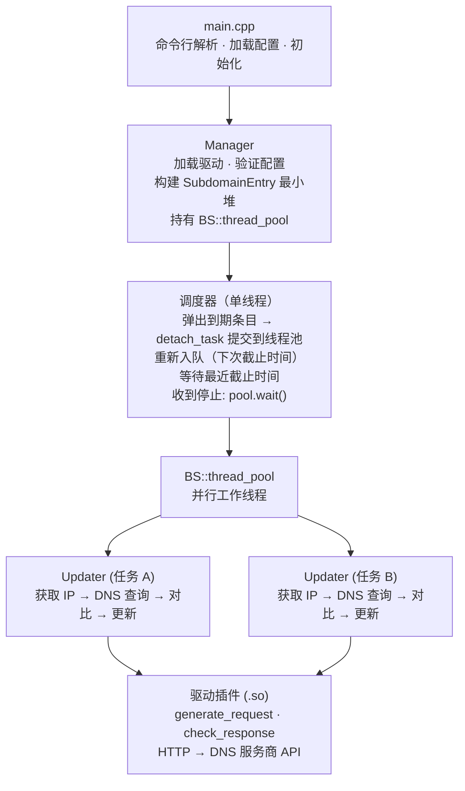

# yaddnsc — Yet Another Dynamic DNS Client
**yaddnsc** 是一个基于 C++23 的现代动态 DNS（DDNS）客户端。它监控本机 IP 地址的变化，并通过插件式驱动架构自动更新支持的 DNS 服务商上的域名解析记录。

## 功能特性

- **多域名、多子域名管理** — 单个配置文件即可管理多个域名及其子域名。
- **插件化驱动架构** — 驱动以共享库（`.so`）形式在运行时通过 `dlopen` 动态加载。内置驱动：
  - [Cloudflare](https://www.cloudflare.com/) — 通过 Cloudflare API v4 更新 DNS 记录
  - [DigitalOcean](https://www.digitalocean.com/) — 通过 DigitalOcean API v2 更新 DNS 记录
  - [DNSPod](https://www.dnspod.com/) — 通过 DNSPod API 更新 DNS 记录（同时支持国内和国际端点）
  - [Simple](https://github.com/Kotarou/yaddnsc) — 通用 HTTP GET 驱动，适用于自定义 API
- **灵活的 IP 来源配置** — 每个子域名可独立选择：
  - `interface` — 从本地网卡获取 IP 地址
  - `url` — 从外部 HTTP 服务获取 IP 地址（如 `https://ifconfig.me`）
- **子域名级更新间隔** — 每个子域名可单独设置更新间隔，不设置则继承域名级别配置。
- **IPv4 和 IPv6 支持** — 可独立配置 A 和 AAAA 记录。
- **自定义 DNS 解析器** — 可选使用特定 DNS 服务器代替系统默认解析器。支持**多服务器并发查询** + 自动容灾（同时向所有配置的解析器发起查询，取最快响应）。
- **强制更新调度** — 即使 IP 未发生变化，也可按设定周期强制更新 DNS 记录。
- **优雅退出** — 通过专用信号处理线程捕获 SIGINT/SIGTERM，使用 stop_token 安全停止所有任务。
- **线程池并发** — 子域名更新任务通过 `BS::thread_pool` 并行执行。
- **C++23 标准** — 使用现代 C++，基于 `std::format`（或回退到 fmt 库）和 `std::jthread`。
- **跨平台** — CI 自动构建覆盖 Linux（Ubuntu）和 macOS。

## 架构概览



**线程模型：** 单调度器线程维护一个 `SubdomainEntry` 最小堆（按截止时间排序）。子域名到期时，调度器将其弹出堆，把实际工作（IP 检测、DNS 对比、HTTP 更新）提交到共享线程池，然后以新的截止时间重新入队。调度器在条件变量上等待，直到最近截止时间或收到停止请求。关闭时等待线程池中所有任务完成后再返回。

## 构建要求

### 前置依赖

| 工具/库    | 最低版本     |
|---------|----------|
| CMake   | 3.28     |
| C++ 编译器 | 支持 C++23 |
| OpenSSL | 任意较新版本   |
| Zlib    | 任意较新版本   |

yaddnsc 仅支持 POSIX 系统。支持的编译器：GCC 14+、Clang 18+、Apple Clang 15+

### 编译方法

```bash
# 安装系统依赖（Debian/Ubuntu）
sudo apt install libssl-dev zlib1g-dev build-essential cmake

# 安装系统依赖（macOS）
brew install openssl@3 cmake

# 编译
mkdir build && cd build
cmake .. -DCMAKE_BUILD_TYPE=Release
make -j$(nproc)

# 主程序位于 build/objs/yaddnsc
# 驱动模块位于 build/objs/driver/*.so
```

### CMake 选项

| 选项                 | 默认值     | 说明                       |
|--------------------|---------|--------------------------|
| `CMAKE_BUILD_TYPE` | Release | 设为 `Debug` 可生成调试版本       |
| `YADDNSC_LOGGING_PATTERN` | `[%D %T.%e] [%^%8l%$] [%8!t] [%15!s:%-4#] %v` | 传递给 spdlog::set_pattern() 的日志格式 |
| `YADDNSC_MIN_UPDATE_INTERVAL` | 60 | 最小允许的更新间隔（秒），不能为负数 |

第三方依赖（glaze、spdlog、cpp-httplib、cxxopts、BS::thread_pool、fmt、magic_enum）通过 CPM.cmake 自动下载。

## 配置文件说明

yaddnsc 使用 JSON 格式的配置文件。默认查找 `./config.json`，可通过 `-c` 参数指定其他路径。

模板配置文件见 `config.example.json`。

### 配置示例

```json
{
  "driver": {
    "driver_dir": "/opt/yaddnsc/drivers",
    "load": [
      "cloudflare.so",
      "simple.so"
    ]
  },
  "resolver": {
    "use_custom_server": false,
    "ipaddress": "1.1.1.1",
    "port": 53,
    "servers": [
      { "ipaddress": "1.1.1.1", "port": 53 },
      { "ipaddress": "8.8.8.8", "port": 53 }
    ]
  },
  "domains": [
    {
      "name": "example.com",
      "update_interval": 300,
      "force_update": 0,
      "driver": "cloudflare",
      "subdomains": [
        {
          "name": "home",
          "type": "aaaa",
          "interface": "eth0",
          "ip_source": "interface",
          "ip_type": "ipv6",
          "ip_source_param": "",
          "allow_ula": false,
          "allow_local_link": false,
          "update_interval": 600,
          "driver_param": {
            "zone_id": "your-zone-id",
            "record_id": "your-record-id",
            "token": "your-api-token"
          }
        },
        {
          "name": "home",
          "type": "a",
          "interface": "",
          "ip_source": "url",
          "ip_type": "ipv4",
          "ip_source_param": "https://ipv4.example.com/",
          "allow_ula": false,
          "allow_local_link": false,
          "driver_param": {
            "zone_id": "your-zone-id",
            "record_id": "your-record-id",
            "token": "your-api-token"
          }
        }
      ]
    }
  ]
}
```

### 配置字段参考

#### 顶层字段

| 字段         | 类型     | 说明                |
|------------|--------|-------------------|
| `driver`   | object | 驱动加载配置            |
| `resolver` | object | 自定义 DNS 解析器设置（可选） |
| `domains`  | array  | 域名配置列表            |

#### `driver` 对象

| 字段           | 类型       | 说明              |
|--------------|----------|-----------------|
| `driver_dir` | string   | 驱动 `.so` 文件所在目录 |
| `load`       | string[] | 需要加载的驱动共享库文件名列表 |

#### `resolver` 对象

| 字段                  | 类型           | 说明                                                                                                  |
|---------------------|--------------|-----------------------------------------------------------------------------------------------------|
| `use_custom_server` | boolean      | 为 true 时使用指定的 DNS 服务器                                                                              |
| `ipaddress`         | string       | DNS 服务器 IP 地址（旧字段，仅当 `servers` 为空时生效）                                                              |
| `port`              | integer      | DNS 服务器端口，通常为 53（旧字段，仅当 `servers` 为空时生效）                                                            |
| `servers`           | DnsServer[]  | DNS 服务器列表，用于冗余容灾。配置多个服务器时，会**并发**发起所有查询，取最快成功响应。如果所有服务器均失败，则传播最终错误。                                    |

当 `servers` 数组存在且非空时，`ipaddress` 和 `port` 被忽略。在不支持 `res_nquery()` 的平台（如某些 musl 构建）上，自定义服务器不可用，始终使用系统解析器。

> **IPv6 说明：** 地址**不要**带方括号，例如 `"2606:4700:4700::1111"`。方括号用于 URI 字面量（如 `[::1]:53`），但 `inet_pton()` 解析时需要纯地址格式。

#### `domains[]` 对象

| 字段                | 类型     | 说明                                             |
|-------------------|--------|------------------------------------------------|
| `name`            | string | 域名（如 `example.com`）                            |
| `update_interval` | int    | 更新间隔，单位秒（最小值为 60）。作为所有子域名的默认值。                 |
| `force_update`    | int    | 强制更新间隔，单位秒（0 表示禁用）。如设置，必须 >= `update_interval` |
| `driver`          | string | 使用的驱动名称（必须与已加载的驱动匹配）                           |
| `subdomains`      | array  | 需要管理的子域名记录列表                                   |

#### `subdomains[]` 对象

| 字段                 | 类型      | 说明                                                    |
|--------------------|---------|-------------------------------------------------------|
| `name`             | string  | 子域名名称（如 `home` 对应 `home.example.com`）                 |
| `type`             | string  | DNS 记录类型：`"a"`、`"aaaa"`、`"txt"` 或 `"soa"`             |
| `interface`        | string  | 网卡接口名称（如 `eth0`）。`ip_source` 为 `"interface"` 时必须设置    |
| `ip_source`        | string  | IP 来源：`"interface"`（从本地网卡读取）或 `"url"`（通过 HTTP 获取）     |
| `ip_type`          | string  | IP 版本：`"ipv4"`、`"ipv6"` 或 `"unspecified"`             |
| `ip_source_param`  | string  | 当 `ip_source` 为 `"url"` 时：HTTP(S) URL                 |
| `allow_ula`        | boolean | 使用 IPv6 接口来源时，是否允许唯一本地地址（ULA），默认 false                |
| `allow_local_link` | boolean | 使用 IPv6 接口来源时，是否允许链路本地地址，默认 false                     |
| `update_interval`  | int     | 子域名级更新间隔，单位秒（可选）。0 或省略 = 继承自 `domain.update_interval` |
| `driver_param`     | object  | 驱动特定参数（键值对）                                           |

## 驱动参数说明

每个驱动需要在 `driver_param` 中设置特定参数。

### Cloudflare（`cloudflare.so`）

| 参数          | 必需 | 说明                                   |
|-------------|----|--------------------------------------|
| `zone_id`   | 是  | Cloudflare Zone ID                   |
| `record_id` | 是  | Cloudflare DNS 记录 ID                 |
| `token`     | 是  | Cloudflare API Token（需要 DNS:Edit 权限） |
| `proxied`   | 否  | 是否通过 Cloudflare 代理（CDN）              |
| `ttl`       | 否  | TTL，单位秒（默认 30）                       |

API 端点：`PUT https://api.cloudflare.com/client/v4/zones/{ZONE_ID}/dns_records/{RECORD_ID}`

### DigitalOcean（`digital_ocean.so`）

| 参数          | 必需 | 说明                                 |
|-------------|----|------------------------------------|
| `domain`    | 是  | 域名                                 |
| `record_id` | 是  | DigitalOcean DNS 记录 ID             |
| `token`     | 是  | DigitalOcean Personal Access Token |

API 端点：`PUT https://api.digitalocean.com/v2/domains/{DOMAIN}/records/{RECORD_ID}`

### DNSPod（`dnspod.so`）

| 参数               | 必需 | 说明                                |
|------------------|----|-----------------------------------|
| `domain_id`      | 是  | DNSPod 域名 ID                      |
| `record_id`      | 是  | DNSPod 记录 ID                      |
| `subdomain`      | 是  | 子域名名称                             |
| `login_token`    | 是  | DNSPod API 登录令牌（ID,Token 格式）      |
| `global`         | 否  | 使用国际 API 端点（`"1"`）或国内端点（`"0"`，默认） |
| `record_line`    | 否  | 记录线路（如 `"默认"`）                    |
| `record_line_id` | 否  | 记录线路 ID                           |

API 端点：
- 国内：`POST https://dnsapi.cn/Record.Ddns`
- 国际：`POST https://api.dnspod.com/Record.Ddns`

### Simple（`simple.so`）

| 参数       | 必需 | 说明                                                                                  |
|----------|----|-------------------------------------------------------------------------------------|
| `url`    | 是  | 要调用的 HTTP(S) URL。支持格式占位符。                                                           |
| `format` | 否  | 如果设置，URL 会被视为格式字符串。`driver_param` 中以 `{` 开头、`}` 结尾的键会被替换（如 `{ip_addr}` 替换为检测到的 IP）。 |

只要响应的 body 非空即视为成功。

## 使用方法

```bash
# 使用默认配置路径
yaddnsc

# 指定配置文件
yaddnsc -c /etc/yaddnsc/config.json

# 启用详细日志（调试模式）
yaddnsc -v

# 打印版本号
yaddnsc -V

# 打印帮助信息
yaddnsc -h
```

### Systemd 服务

项目提供了 systemd 服务文件 `yaddnsc.service`：

```bash
sudo cp yaddnsc /opt/yaddnsc/
sudo mkdir -p /etc/yaddnsc/
sudo cp config.json /etc/yaddnsc/
sudo cp yaddnsc.service /etc/systemd/system/
sudo systemctl enable --now yaddnsc
```

## 编写自定义驱动

驱动是运行时加载的共享库。编写自定义驱动的步骤：

1. 包含 `driver/base_driver.h`，继承 `BaseDriver` 类。
2. 实现 `IDriver` 接口的三个纯虚方法：
   - `generate_request(config)` → 构造 `driver_request`（URL、HTTP 方法、请求头、请求体）
   - `check_response(response)` → 验证 API 响应
   - `get_detail()` → 返回驱动元信息（名称、描述、作者、版本）
3. 在实现文件末尾使用 `DEFINE_DRIVER_CREATE(YourDriverClass)` 宏导出工厂函数。
4. 将驱动编译为 `MODULE` 库（位置无关代码，不添加 `lib` 前缀）。
5. 将生成的 `.so` 文件放到驱动目录，并在配置的 `load` 列表中添加该驱动。

驱动中使用 `CORE_LOG_*` 宏记录日志——这些宏通过 `dlopen` 时的符号解析，将日志委托给主程序的日志子系统。

## 依赖项

| 库                                                           | 用途                          | 管理方式      |
|-------------------------------------------------------------|-----------------------------|-----------|
| [glaze](https://github.com/stephenberry/glaze)              | JSON 序列化/反射                 | CPM.cmake |
| [spdlog](https://github.com/gabime/spdlog)                  | 日志记录                        | CPM.cmake |
| [cpp-httplib](https://github.com/yhirose/cpp-httplib)       | HTTP 客户端                    | CPM.cmake |
| [cxxopts](https://github.com/jarro2783/cxxopts)             | 命令行参数解析                     | CPM.cmake |
| [BS::thread_pool](https://github.com/bshoshany/thread-pool) | 线程池                         | CPM.cmake |
| [fmt](https://github.com/fmtlib/fmt)                        | 字符串格式化（std::format 不可用时的回退） | CPM.cmake |
| [magic_enum](https://github.com/Neargye/magic_enum)         | 静态枚举反射                      | CPM.cmake |
| OpenSSL                                                     | TLS 支持                      | 系统库       |
| Zlib                                                        | 压缩                          | 系统库       |

## 许可证

本项目遵循 [LICENSE](LICENSE) 文件中的许可条款。
