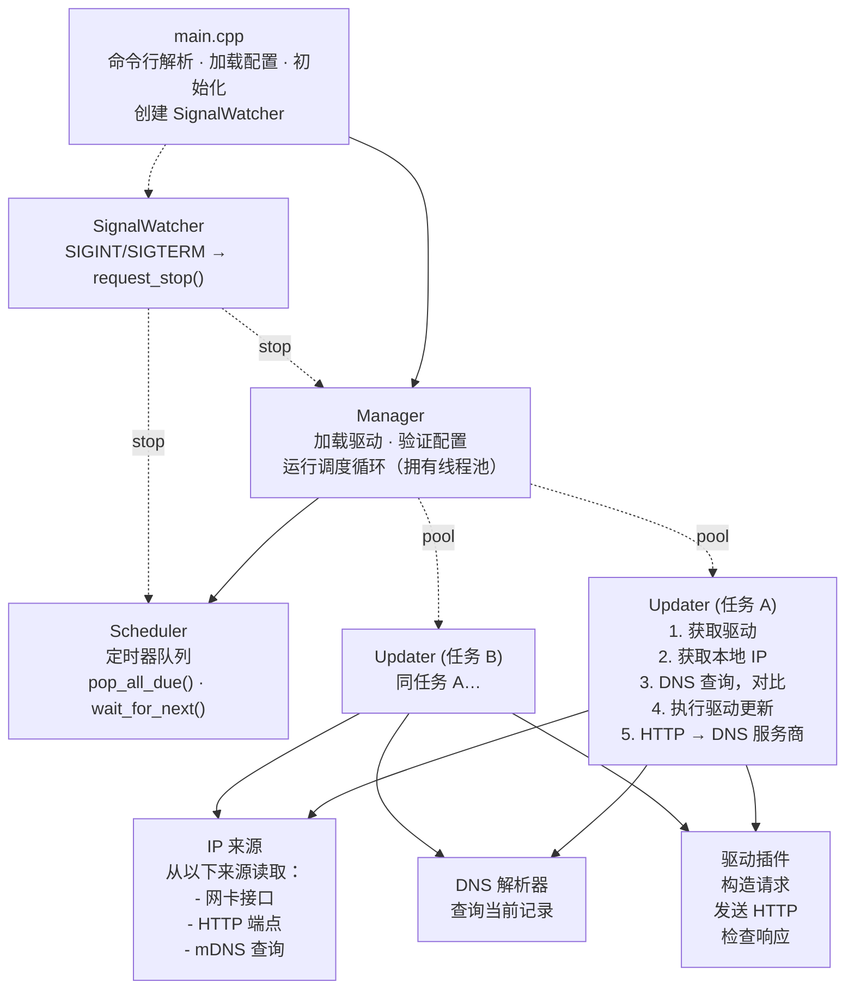

# yaddnsc — Yet Another Dynamic DNS Client

[](https://codecov.io/gh/Kotarou/yaddnsc)

> **⚠️ 注意：** `master` 分支（v1.x）正在积极开发中，v1 ABI 尚未最终确定，可能会有较大改动，每次更新后插件**必须**重新编译。

**yaddnsc** 是一个基于 C++23 的现代动态 DNS（DDNS）客户端。它监控本机 IP 地址的变化，并通过插件式驱动架构自动更新 DNS 服务商上的域名解析记录。

## 功能特性

- **多域名、多子域名管理** — 单个配置文件即可管理多个域名及其子域名。
- **插件化驱动架构** — 驱动以共享库（`.so`）形式在运行时通过 `dlopen` 动态加载。内置驱动包括：
  - [Cloudflare](https://www.cloudflare.com/) — 通过 Cloudflare API v4 更新 DNS 记录
  - [DigitalOcean](https://www.digitalocean.com/) — 通过 DigitalOcean API v2 更新 DNS 记录
  - [DNSPod](https://www.dnspod.com/) — 通过 DNSPod API 更新 DNS 记录（同时支持国内和国际端点）
  - [Simple](https://github.com/Kotarou/yaddnsc) — 通用 HTTP 驱动，支持 URL 模板替换，适用于自定义 API
- **灵活的 IP 来源配置** — 每个子域名可独立选择：
  - `interface` — 从本地网卡获取 IP 地址
  - `http` — 从外部 HTTP 服务获取 IP 地址（如 `https://ifconfig.me`）
  - `mdns` — 通过 mDNS（RFC 6762）发现局域网设备的 IP 地址（如 `printer.local`）
- **子域名级更新间隔** — 每个子域名可单独设置更新间隔，未设置时继承域名级别的配置。
- **IPv4 和 IPv6 支持** — 可独立配置 A 和 AAAA 记录。
- **自定义 DNS 解析器** — 可选使用特定 DNS 服务器代替系统解析器。支持**传统 DNS**、**DNS-over-HTTPS (DoH)** 和 **DNS-over-TLS (DoT)**，并提供可配置的查询策略。详见 [DNS 解析器](#dns-解析器)。
- **强制更新调度** — 即使 IP 未发生变化，也可按设定周期强制更新 DNS 记录。
- **优雅退出** — 通过专用信号处理线程捕获 SIGINT/SIGTERM，使用 stop_token 安全停止所有任务。
- **线程池并发** — 子域名更新任务通过线程池并行执行。
- **C++23 标准** — 性能更好、代码更安全可靠、减少外部依赖。
- **跨平台** — 支持 POSIX 平台，包括 Linux (glibc)、Linux (musl)、macOS、FreeBSD 等。CI 编译通过 Linux (glibc) 和 macOS (arm64)。

## 架构概览



## 构建要求

### 前置依赖

| 工具/库       | 最低版本                                         |
|------------|------------------------------------------------|
| 操作系统       | POSIX（Linux、macOS、*BSD）                        |
| CMake      | 3.28                                           |
| C++ 编译器    | 支持 C++23（GCC 14+、Clang 18+、Apple Clang 15+） |
| OpenSSL    | 3.0+                                           |
| pkg-config | 任意版本（Linux 必需，macOS 可选）                     |

### 编译方法

```bash
# 安装系统依赖（Debian/Ubuntu）
sudo apt install libssl-dev build-essential cmake pkg-config

# 安装系统依赖（macOS）
brew install openssl@3 cmake pkg-config

# 编译
cmake -B build -DCMAKE_BUILD_TYPE=Release
cmake --build build -j$(nproc)

# 安装到指定前缀目录
cmake --install build --prefix /usr --sysconfdir /etc

# 或安装到系统（DESTDIR 支持打包）
sudo cmake --install build
```

### 平台注意事项

**老旧设备** — 如果工具链版本过低（GCC < 14 或 Clang < 18），请使用 `v0.x` 分支（C++17、CMake 3.14+、OpenSSL 1.1.x）。该分支仅维护 bug 修复，新功能在 master 上开发。

**Alpine Linux (musl)** — `YADDNSC_USE_NATIVE_DNS` 在 musl 上默认启用（musl 的系统解析器功能有限，不支持可重入的 `res_nquery`）。注意：内置 resolver/parser 目前为 [实验性]；如遇到稳定性问题，可设置 `-DYADDNSC_USE_NATIVE_DNS=OFF` 回退到 libresolv。

### 测试

单元测试适用于工具类、DNS 协议、校验和配置组件。
测试由 `YADDNSC_BUILD_TESTS` CMake 选项控制（默认：OFF）。构建并运行测试：

```bash
cmake -B build -DCMAKE_BUILD_TYPE=Debug -DYADDNSC_BUILD_TESTS=ON
cmake --build build -j$(nproc)
ctest --test-dir build --output-on-failure
```

核心编排组件（Manager、Scheduler、Updater）的集成测试计划在后续重构中解耦这些组件并引入可注入接口后添加。

### CMake 选项

| 选项                            | 默认值                                           | 说明                             |
|-------------------------------|-----------------------------------------------|--------------------------------|
| `CMAKE_BUILD_TYPE`            | Release                                       | 设为 `Debug` 可生成调试版本             |
| `YADDNSC_MIN_UPDATE_INTERVAL` | 60                                            | 最小允许的更新间隔（秒）                    |
| `YADDNSC_USE_NATIVE_DNS`      | OFF                                           | [实验性] 使用内置 DNS 查询和解析器（不依赖 libresolv）。稳定后将默认启用，最终会移除系统 libresolv 路径以获得更好的可移植性。 |
| `YADDNSC_DEFAULT_DNS_SERVER`  | 1.1.1.1                                       | 未配置时的默认 DNS 服务器地址              |
| `YADDNSC_DEFAULT_DNS_PORT`    | 53                                            | 未配置时的默认 DNS 服务器端口              |
| `YADDNSC_USE_SYSTEM_SPDLOG`   | OFF                                           | 使用系统 spdlog 代替 CPM 下载的版本         |
| `YADDNSC_BUILD_DOCS`          | OFF                                           | 从源码注释构建 Doxygen API 文档             |
| `YADDNSC_BUILD_TESTS`         | OFF                                           | 构建单元测试（需要 GoogleTest，通过 CPM.cmake 获取） |
| `YADDNSC_ENABLE_DEB`          | OFF                                           | 启用 CPack DEB 包生成                |

#### 构建 DEB 包

```bash
# 本地构建
cmake -B build -DCMAKE_BUILD_TYPE=Release -DYADDNSC_ENABLE_DEB=ON
cmake --build build -j$(nproc)
cpack --config build/CPackConfig.cmake -G DEB

# 或使用基于 Docker 的 DEB 构建工具（推荐用于 CI）
./docker/build-deb.sh          # 为 Ubuntu 24.04 构建
./docker/build-deb.sh 24.04 26.04  # 为多个版本构建
```

#### Docker（多阶段构建）

项目提供了多阶段 Dockerfile（`Dockerfile`），用于在 Alpine Linux 上构建和运行 yaddnsc：

```bash
docker build -t yaddnsc .
docker run yaddnsc --help
```

Docker 构建生成一个极小化的运行时镜像，仅包含所需的共享库（OpenSSL、zlib、brotli、libstdc++），以非 root 用户运行，并预置默认配置文件。

#### Doxygen API 文档

可通过 Doxygen 从源码注释生成 API 文档：

```bash
cmake -B build -DCMAKE_BUILD_TYPE=Release -DYADDNSC_BUILD_DOCS=ON
cmake --build build -j$(nproc)
make -C build doxygen   # 在 build/docs/ 生成 HTML 文档
```

需要安装 `doxygen`，可选安装 `graphviz`（用于生成图表）。

第三方依赖通过 CPM.cmake 自动下载。

## 配置文件说明

yaddnsc 使用 JSON 格式的配置文件。默认查找 `./config.json`，可通过 `-c` 参数指定其他路径。

模板配置文件在构建时由 `template/deb/yaddnsc_config.json` 生成，并安装到系统配置目录（`${sysconfdir}/yaddnsc/config.json`）。

### 配置示例

```json
{
  "driver": {
    "driver_dir": "/opt/yaddnsc/drivers",
    "auto_discover": false,
    "load": [
      "cloudflare.so",
      "simple.so"
    ]
  },
  "resolver": {
    "use_custom_server": false,
    "strategy": "concurrent",
    "servers": [
      { "address": "1.1.1.1", "port": 53 },
      { "address": "8.8.8.8", "port": 53 }
    ]
  },
  "domains": [
    {
      "name": "example.com",
      "update_interval": 300,
      "force_update": 0,
      "driver": "cloudflare",
      "subdomains": [
        {
          "name": "home",
          "type": "aaaa",
          "interface": "eth0",
          "ip_source": "interface",
          "allow_ula": false,
          "allow_local_link": false,
          "update_interval": 600,
          "driver_param": {
            "zone_id": "your-zone-id",
            "record_id": "your-record-id",
            "token": "your-api-token"
          }
        },
        {
          "name": "home",
          "type": "a",
          "ip_source": "http",
          "ip_source_param": "https://ipv4.example.com/",
          "allow_ula": false,
          "allow_local_link": false,
          "driver_param": {
            "zone_id": "your-zone-id",
            "record_id": "your-record-id",
            "token": "your-api-token"
          }
        }
      ]
    }
  ]
}
```

### 配置字段参考

#### 顶层字段

| 字段        | 类型     | 说明               |
|-----------|--------|------------------|
| `driver`  | object | 驱动加载配置           |
| `resolver`| object | 自定义 DNS 解析器设置（可选） |
| `domains` | array  | 域名配置列表           |

#### `driver` 对象

| 字段              | 类型       | 说明                                                  |
|-----------------|----------|-----------------------------------------------------|
| `driver_dir`    | string   | 驱动 `.so` 文件所在目录。**可选** — 省略时默认为 `${libdir}/yaddnsc/drivers`（如 `/usr/lib/yaddnsc/drivers`） |
| `auto_discover` | boolean  | 为 true 时自动加载 `driver_dir` 下所有 `.so` 文件（忽略 `load` 列表）。默认值: `true` |
| `load`          | string[] | 需要加载的驱动共享库文件名列表（`auto_discover` 为 true 时忽略）         |

#### `resolver` 对象

| 字段                  | 类型          | 说明                                                                   |
|---------------------|-------------|----------------------------------------------------------------------|
| `use_custom_server` | boolean     | 为 true 时使用指定的 DNS 服务器                                            |
| `servers`           | DnsServer[] | DNS 服务器列表。支持的地址格式及各类型详见 [DNS 解析器](#dns-解析器)                   |
| `address`           | string      | **（已废弃，将在未来版本移除）** 直接在 resolver 级别指定 DNS 服务器地址。请改用 `servers`。 |
| `ipaddress`         | string      | **（已废弃，将在未来版本移除）** `address` 的别名。请改用 `servers` 数组中的 `address`。  |
| `port`              | int         | **（已废弃，将在未来版本移除）** 与 `address` 配合使用的端口号，默认 53。请改用 `servers`。 |
| `strategy`          | string      | 查询策略：`"concurrent"`（默认）或 `"fallback"`。详见 [DNS 解析器](#dns-解析器）   |

#### `DnsServer` 对象

| 字段          | 类型      | 说明                                               |
|-------------|---------|--------------------------------------------------|
| `address`   | string  | DNS 服务器地址。                                      |
| `ipaddress`  | string  | **（已废弃，将在未来版本移除）** `address` 的别名。              |
| `port`      | int     | 端口号，默认 53。                                      |

> `address` 支持的格式详见 [DNS 解析器](#dns-解析器)（传统 DNS、DoH、DoT）。

#### `domains[]` 对象

| 字段                | 类型     | 说明                                             |
|-------------------|--------|------------------------------------------------|
| `name`            | string | 域名（如 `example.com`）                            |
| `update_interval` | int    | 更新间隔，单位秒（最小值为 60）。作为所有子域名的默认值。                 |
| `force_update`    | int    | 强制更新间隔，单位秒（0 表示禁用）。如设置，必须 >= `update_interval` |
| `driver`          | string | 使用的驱动名称（必须与已加载的驱动匹配）                           |
| `subdomains`      | array  | 需要管理的子域名记录列表                                   |

#### `subdomains[]` 对象

| 字段                 | 类型      | 说明                                                                            |
|--------------------|---------|-------------------------------------------------------------------------------|
| `name`             | string  | 子域名名称（如 `home` 对应 `home.example.com`）                                         |
| `type`             | string  | DNS 记录类型：`"a"`、`"aaaa"`、`"txt"` 或 `"soa"`。自动决定地址族（A → IPv4，AAAA → IPv6）。 |
| `interface`        | string  | 网卡接口名称（如 `eth0`）。各来源对此字段的要求详见 [IP 来源说明](#ip-来源说明)。                     |
| `ip_type`          | string  | **已废弃——被忽略。** 地址族现在由 `type` 自动推导（A → IPv4，AAAA → IPv6）。                    |
| `ip_source`        | string  | IP 来源策略：`"interface"`、`"http"` 或 `"mdns"`。`"url"` 是 `"http"` 的旧名称（已废弃，将在未来版本移除）。详见 [IP 来源说明](#ip-来源说明）。 |
| `ip_source_param`  | string  | 来源相关参数（`"http"` 为 URL，`"mdns"` 为 mDNS 主机名）。详见 [IP 来源说明](#ip-来源说明)。       |
| `allow_ula`        | boolean | 使用 IPv6 接口来源时，是否允许唯一本地地址（ULA），默认 false                                        |
| `allow_local_link` | boolean | 使用 IPv6 接口来源时，是否允许链路本地地址，默认 false                                             |
| `update_interval`  | int     | 子域名级更新间隔，单位秒（可选）。0 或省略 = 继承自 `domain.update_interval`                         |
| `driver_param`     | object  | 驱动特定参数（键值对）                                                                   |

## IP 来源说明

`subdomains[]` 中的 `ip_source` 字段决定了 yaddnsc 如何发现要更新的 IP 地址。支持三种来源：

### `interface` — 从本地网卡读取

直接从指定的本地网络接口（NIC）读取 IP 地址。适用于设备有固定本地地址，或需要报告特定网卡绑定的地址时。

```json
{
    "name": "home",
    "type": "a",
    "interface": "eth0",
    "ip_source": "interface"
}
```

### `http` — 通过 HTTP(S) 端点获取

通过向外部 HTTP(S) 服务发送请求来获取公网 IP，服务端在响应体中返回客户端的 IP 地址（例如 `https://api.ipify.org`）。HTTP 请求会绑定到指定的网卡。

```json
{
    "name": "home",
    "type": "a",
    "interface": "eth0",
    "ip_source": "http",
    "ip_source_param": "https://api.ipify.org"
}
```

### `mdns` — 通过 mDNS 发现（RFC 6762）

通过发送多播 DNS 查询来发现局域网中某设备的 IP 地址，查询目标为 `.local` 主机名（如 `printer.local`）。适用于检测局域网设备（如打印机、NAS、IoT 设备）的地址。

```json
{
    "name": "printer",
    "type": "a",
    "ip_source": "mdns",
    "ip_source_param": "printer.local"
}
```

```json
{
    "name": "nas",
    "type": "aaaa",
    "interface": "eth0",
    "ip_source": "mdns",
    "ip_source_param": "nas.local"
}
```

## DNS 解析器

yaddnsc 可使用自定义 DNS 服务器进行记录查询，而非使用系统默认解析器。在配置文件顶层配置 `resolver` 对象。

### 解析器类型

支持三种解析器类型，根据地址格式自动识别：

#### 传统 DNS（UDP/TCP）

通过 UDP（大响应时使用 TCP）在指定 IP 和端口上使用标准 DNS 协议。编译时可选择底层实现：
- `YADDNSC_USE_NATIVE_DNS=OFF`（默认）— 使用系统 libresolv 进行传输（`res_nquery`）
- `YADDNSC_USE_NATIVE_DNS=ON` — 使用内置的 UDP/TCP 实现（不依赖 libresolv — **实验性**）

> **实验性说明：** 内置 resolver/parser（`ON`）仍在打磨中。稳定后将默认启用，并最终移除系统 libresolv 路径。目标是获得更好的跨平台可移植性和对传输层的完全控制。

使用 `YADDNSC_USE_NATIVE_DNS=ON` 时，DNS 报文解析完全自实现（不依赖 libresolv）。在默认的 `OFF` 模式下，resolver 和 parser 均依赖 libresolv（`res_nquery` / `ns_initparse`）。

```json
{
  "resolver": {
    "use_custom_server": true,
    "servers": [
      { "address": "1.1.1.1", "port": 53 },
      { "address": "8.8.8.8", "port": 53 }
    ]
  }
}
```

#### DNS-over-HTTPS (DoH)

通过 HTTPS POST 加密 DNS 查询（RFC 8484）。地址必须是完整的 HTTPS URL，包含路径（如 `https://1.1.1.1/dns-query`）。

```json
{
  "resolver": {
    "use_custom_server": true,
    "servers": [
      { "address": "https://1.1.1.1/dns-query" },
      { "address": "https://cloudflare-dns.com/dns-query" }
    ]
  }
}
```

#### DNS-over-TLS (DoT)

通过 TLS 加密 DNS 查询（RFC 7858）。地址为 `tls://` URI 格式。

```json
{
  "resolver": {
    "use_custom_server": true,
    "servers": [
      { "address": "tls://1.1.1.1" }
    ]
  }
}
```

### 查询策略

`strategy` 字段控制多个 DNS 服务器的查询方式：

| 策略          | 行为                                        |
|-------------|-------------------------------------------|
| `concurrent` | **（默认）** 以每批 3 个并发查询，取最快成功响应。                |
| `fallback`   | 依次尝试解析器，当前解析器失败时切换到下一个。                     |

```json
{
  "resolver": {
    "use_custom_server": true,
    "strategy": "fallback",
    "servers": [
      { "address": "https://1.1.1.1/dns-query" },
      { "address": "tls://1.1.1.1" }
    ]
  }
}
```

## 驱动参数说明

每个驱动需要在 `driver_param` 中设置特定参数。

### Cloudflare（`cloudflare.so`）

| 参数          | 必需 | 说明                                   |
|-------------|----|--------------------------------------|
| `zone_id`   | 是  | Cloudflare Zone ID                   |
| `record_id` | 是  | Cloudflare DNS 记录 ID                 |
| `token`     | 是  | Cloudflare API Token（需要 DNS:Edit 权限） |
| `proxied`   | 否  | 是否通过 Cloudflare 代理（CDN）              |
| `ttl`       | 否  | TTL，单位秒（默认 30）                       |

### DigitalOcean（`digital_ocean.so`）

| 参数          | 必需 | 说明                                 |
|-------------|----|------------------------------------|
| `record_id` | 是  | DigitalOcean DNS 记录 ID             |
| `token`     | 是  | DigitalOcean Personal Access Token |

### DNSPod（`dnspod.so`）

| 参数               | 必需 | 说明                                   |
|------------------|----|--------------------------------------|
| `domain_id`      | 是  | DNSPod 域名 ID                         |
| `record_id`      | 是  | DNSPod 记录 ID                         |
| `login_token`    | 是  | DNSPod API 登录令牌（ID,Token 格式）         |
| `global`         | 否  | 使用国际 API 端点（`true`）或国内端点（`false`，默认） |
| `record_line`    | 否  | 记录线路（国内端点默认 `"默认"`，国际端点默认 `"default"`） |
| `record_line_id` | 否  | 记录线路 ID（默认：`"0"`）                    |

### Simple（`simple.so`）

通用 HTTP GET 驱动，适用于自定义 API。将 `url` 视为模板，将 `{key}` 占位符替换为配置中的值和运行时上下文的值。

| 参数    | 必需 | 说明                                                                   |
|-------|----|----------------------------------------------------------------------|
| `url` | 是  | HTTP(S) URL 模板，支持 `{key}` 占位符。`driver_param` 中的其他键都会作为 `{key}` 参与替换。 |

**可用的替换变量：**

| 变量            | 来源             | 说明                              |
|---------------|----------------|---------------------------------|
| `{ip_addr}`   | 运行时            | 检测到的 IP 地址                      |
| `{rd_type}`   | 运行时            | DNS 记录类型（A、AAAA）                |
| `{domain}`    | 运行时            | 域名                              |
| `{subdomain}` | 运行时            | 子域名名称                           |
| `{fqdn}`      | 运行时            | 完整域名                            |
| `{any_key}`   | `driver_param` | `driver_param` 中的任意键（除 `url` 外） |

示例：
```json
{
  "driver_param": {
    "url": "https://api.example.com/update?ip={ip_addr}&type={rd_type}&domain={domain}",
    "key": "my-secret-key"
  }
}
```

只要响应的 body 非空即视为成功。

## 使用方法

```bash
# 运行 DDNS 客户端（默认配置文件：./config.json）
yaddnsc run

# 指定配置文件并启用详细日志
yaddnsc run -c /etc/yaddnsc/config.json -d

# 验证配置文件
yaddnsc config test

# 静默验证（仅通过退出码判断）
yaddnsc config test -q
yaddnsc config test --quiet

# 打印解析后的配置 JSON
yaddnsc config show

# 列出已加载的驱动
yaddnsc driver list

# 查看驱动详情
yaddnsc driver info <name>

# 列出网络接口
yaddnsc interface list

# 查看指定接口的 IP 地址
yaddnsc interface ip <name>

# DNS 解析主机名
yaddnsc dns resolve <hostname> [--type A|AAAA|TXT|SOA]

# 查看 DNS 解析器配置
yaddnsc dns resolver

# 打印版本号
yaddnsc --version

# 打印帮助信息
yaddnsc --help
yaddnsc <subcommand> --help
```

### Systemd 服务

systemd 服务文件在构建时由 `template/deb/yaddnsc.service.in` 生成，当检测到系统安装了 systemd 时由 `cmake --install` 自动安装。它集成了启动前配置验证（`config test`）、安全加固（DynamicUser、ProtectSystem、ProtectHome），并支持通过系统配置目录下的环境文件覆盖配置路径等环境变量：

```bash
# 正常安装 — 服务文件会自动放置
sudo cmake --install build

# 启用并启动服务
sudo systemctl daemon-reload
sudo systemctl enable --now yaddnsc

# 可选：覆盖配置文件路径
sudo mkdir -p /etc/yaddnsc/default
echo 'YADDNSC_CONFIG=/custom/path/config.json' | sudo tee /etc/yaddnsc/default/yaddnsc
```

> **注意：** 服务文件在构建时使用 cmake 替换的路径，因此二进制文件、配置和环境文件的位置由配置时传递的 `CMAKE_INSTALL_BINDIR` 和 `CMAKE_INSTALL_SYSCONFDIR` 变量决定。

## 编写自定义驱动

驱动是运行时加载的共享库。编写自定义驱动的步骤：

1. 包含 `driver/base.h`，继承 `BaseDriver` 类。
2. 实现 `Driver` 接口的纯虚方法：
   - `generate_request(config, ctx)` — 构造 `DriverRequestContext`（包含 URL 及 `DriverRequest`：HTTP 方法、请求头、请求体）
   - `check_response(response)` — 验证 API 响应体
   - `get_detail()` — 返回驱动元信息（名称、描述、作者、版本）
   - `get_abi_version()` — ABI 版本检查（`BaseDriver` 中已实现为 `final`，无需覆盖）
   - `execute(config, ctx, http)` — 执行完整的更新流程（`BaseDriver` 提供默认实现，多步骤工作流可覆盖）
3. 在实现文件末尾使用 `DEFINE_DRIVER_FACTORY(YourDriverClass)` 宏导出 `create()` 和 `destroy()` 工厂函数。

> **关于自定义（第三方）驱动的建议**
>
> **始终将自定义驱动与 yaddnsc 源码树一同编译**，不要独立构建。
> 即便使用了语义化 ABI 版本号，不同编译器、工具链或构建配置之间的
> ABI 兼容性仍然很脆弱——主程序在加载驱动时会进行 ABI 版本检查，
> 如果驱动基于不同版本的 `Driver` 接口编译，会被拒绝加载。
> 将自定义驱动的源代码放入 `driver/` 目录并一起重新编译，
> 可以确保驱动始终与主程序的 ABI 保持一致。
>
> `driver/` 下的 CMakeLists.txt 提供了可直接参考的模板，
> 每个子目录会自动被发现并参与构建。

如果仍需独立编译为共享库，请确保：
- 编译器和 C++ 标准与 yaddnsc 一致（C++23，GCC 14+ 或 Clang 18+）。
- 使用相同的 `AbiVersion`（由生成的 `driver_ver.h` 定义）。
- 编译为 `MODULE` 库（位置无关代码，不添加 `lib` 前缀）。

## 依赖项

| 库                                                           | 用途                          | 管理方式      |
|-------------------------------------------------------------|-----------------------------|-----------|
| [glaze](https://github.com/stephenberry/glaze)              | JSON 序列化/反射                 | CPM.cmake |
| [spdlog](https://github.com/gabime/spdlog)                  | 日志记录                        | CPM.cmake |
| [cpp-httplib](https://github.com/yhirose/cpp-httplib)       | HTTP 客户端                    | CPM.cmake |
| [CLI11](https://github.com/CLIUtils/CLI11)                   | 命令行参数解析                     | CPM.cmake |
| [BS::thread_pool](https://github.com/bshoshany/thread-pool) | 线程池                         | CPM.cmake |
| [fmt](https://github.com/fmtlib/fmt)                        | 字符串格式化（std::format 不可用时的回退） | CPM.cmake |
| [magic_enum](https://github.com/Neargye/magic_enum)         | 静态枚举反射                      | CPM.cmake |
| OpenSSL                                                     | TLS 支持                      | 系统库       |

## 许可证

本项目遵循 [LICENSE](LICENSE) 文件中的许可条款。
